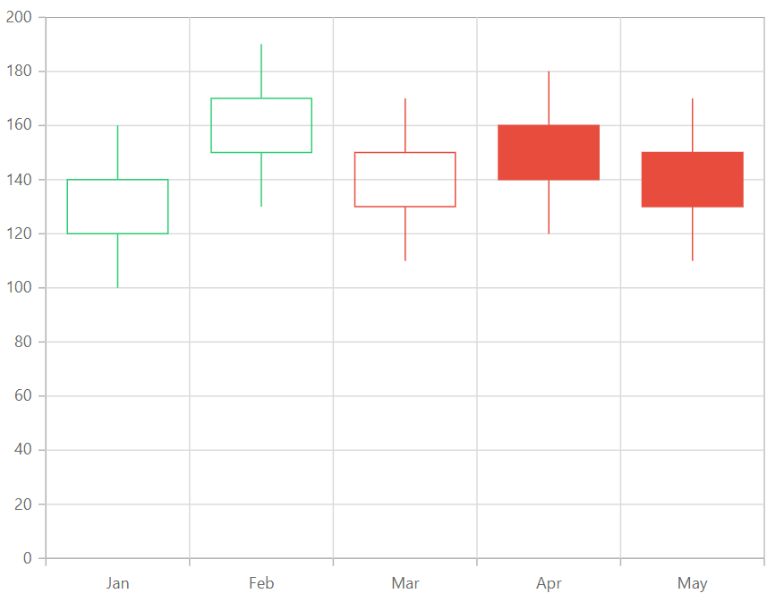

# Candle in Blazor Charts Component

## Candle

[Candle](https://help.syncfusion.com/cr/blazor/Syncfusion.Blazor.Charts.ChartSeriesType.html#Syncfusion_Blazor_Charts_ChartSeriesType_Candle) series is similar to Hilo Open Close series. It is used to represent the **Low**, **High**, **Open and Closing** prices over time. To render a candle series, set series [Type](https://help.syncfusion.com/cr/blazor/Syncfusion.Blazor.Charts.ChartSeries.html#Syncfusion_Blazor_Charts_ChartSeries_Type) as [Candle](https://help.syncfusion.com/cr/blazor/Syncfusion.Blazor.Charts.ChartSeriesType.html#Syncfusion_Blazor_Charts_ChartSeriesType_Candle).

## Hollow candle

[Candle](https://help.syncfusion.com/cr/blazor/Syncfusion.Blazor.Charts.ChartSeriesType.html#Syncfusion_Blazor_Charts_ChartSeriesType_Candle) series allows to visually compare the current price with previous price by customizing its appearance. Candles are filled/left as hollow based on the following criteria.

<!-- markdownlint-disable MD033 -->
<table>
<tr>
<td><b>States</b></td>
<td><b>Description </b></td>
</tr>
<tr>
<td>Filled</td>
<td>Candle sticks are filled when the close value is lesser than the open value.</td>
</tr>
<tr>
<td>Unfilled</td>
<td>Candle sticks are unfilled when the close value is greater than the open value.</td>
</tr>
</table>

The color of the candle will be defined by comparing with previous values. [BullFillColor](https://help.syncfusion.com/cr/blazor/Syncfusion.Blazor.Charts.ChartSeries.html#Syncfusion_Blazor_Charts_ChartSeries_BearFillColor) property is used to apply when the current closing value is greater than the previous closing value and [BearFillColor](https://help.syncfusion.com/cr/blazor/Syncfusion.Blazor.Charts.ChartSeries.html#Syncfusion_Blazor_Charts_ChartSeries_BullFillColor) will be applied when the current closing value is less than the previous closing value. By default, [BullFillColor](https://help.syncfusion.com/cr/blazor/Syncfusion.Blazor.Charts.ChartSeries.html#Syncfusion_Blazor_Charts_ChartSeries_BullFillColor) is **green** and [BearFillColor](https://help.syncfusion.com/cr/blazor/Syncfusion.Blazor.Charts.ChartSeries.html#Syncfusion_Blazor_Charts_ChartSeries_BearFillColor) is **red**.

```cshtml

@using Syncfusion.Blazor.Charts

<SfChart>
    <ChartPrimaryXAxis ValueType="Syncfusion.Blazor.Charts.ValueType.Category">
    </ChartPrimaryXAxis>

    <ChartSeriesCollection>
        <ChartSeries DataSource="@StockDetails" XName="X" High="High" Low="Low" Type="ChartSeriesType.Candle" Open="Open" Close="Close">
        </ChartSeries>
    </ChartSeriesCollection>
</SfChart>

@code{
    public class Data
    {
        public string X { get; set; }
        public double Y { get; set; }
        public double High { get; set; }
        public double Low { get; set; }
        public double Open { get; set; }
        public double Close { get; set; }
    }

    public List<Data> StockDetails = new List<Data>
	{
        new Data{ X= "Jan", Open= 120, High= 160, Low= 100, Close= 140 },
        new Data{ X= "Feb", Open= 150, High= 190, Low= 130, Close= 170 },
        new Data{ X= "Mar", Open= 130, High= 170, Low= 110, Close= 150 },
        new Data{ X= "Apr", Open= 160, High= 180, Low= 120, Close= 140 },
        new Data{ X= "May", Open= 150, High= 170, Low= 110, Close= 130 }
    };
}

``` 



## Solid candles

[EnableSolidCandles](https://help.syncfusion.com/cr/blazor/Syncfusion.Blazor.Charts.ChartSeries.html#Syncfusion_Blazor_Charts_ChartSeries_EnableSolidCandles) property is used to enable/disable the solid candles. By default, it is set as **false**. The fill color of the candle will be defined by its opening and closing values. [BearFillColor](https://help.syncfusion.com/cr/blazor/Syncfusion.Blazor.Charts.ChartSeries.html#Syncfusion_Blazor_Charts_ChartSeries_BearFillColor) will be applied when the opening value is less than the closing value. [BullFillColor](https://help.syncfusion.com/cr/blazor/Syncfusion.Blazor.Charts.ChartSeries.html#Syncfusion_Blazor_Charts_ChartSeries_BullFillColor) will be applied when the opening value is greater than closing value.

```cshtml

@using Syncfusion.Blazor.Charts

<SfChart>
    <ChartPrimaryXAxis ValueType="Syncfusion.Blazor.Charts.ValueType.Category">
    </ChartPrimaryXAxis>
	
    <ChartSeriesCollection>
        <ChartSeries DataSource="@StockDetails" XName="X" High="High" BearFillColor="#e56590" BullFillColor="#f8b883" EnableSolidCandles="true"
                     Low="Low" Type="ChartSeriesType.Candle" Open="Open" Close="Close">
        </ChartSeries>
    </ChartSeriesCollection>
</SfChart>

@code{
    public class Data
    {
        public string X { get; set; }
        public double Y { get; set; }
        public double High { get; set; }
        public double Low { get; set; }
        public double Open { get; set; }
        public double Close { get; set; }
    }

    public List<Data> StockDetails = new List<Data>
	{
        new Data{ X= "Jan", Open= 120, High= 160, Low= 100, Close= 140 },
        new Data{ X= "Feb", Open= 150, High= 190, Low= 130, Close= 170 },
        new Data{ X= "Mar", Open= 130, High= 170, Low= 110, Close= 150 },
        new Data{ X= "Apr", Open= 160, High= 180, Low= 120, Close= 140 },
        new Data{ X= "May", Open= 150, High= 170, Low= 110, Close= 130 }
    };
}

``` 


> Refer to our [Blazor Charts](https://www.syncfusion.com/blazor-components/blazor-charts) feature tour page for its groundbreaking feature representations and also explore our [Blazor Chart Example](https://blazor.syncfusion.com/demos/chart/line?theme=bootstrap4) to know various chart types and how to represent time-dependent data, showing trends at equal intervals.

## See Also

* [Data Label](../data-labels)
* [Tooltip](../tool-tip)