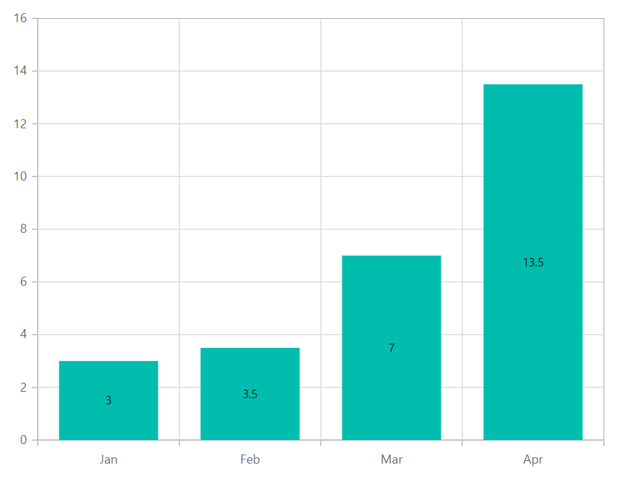
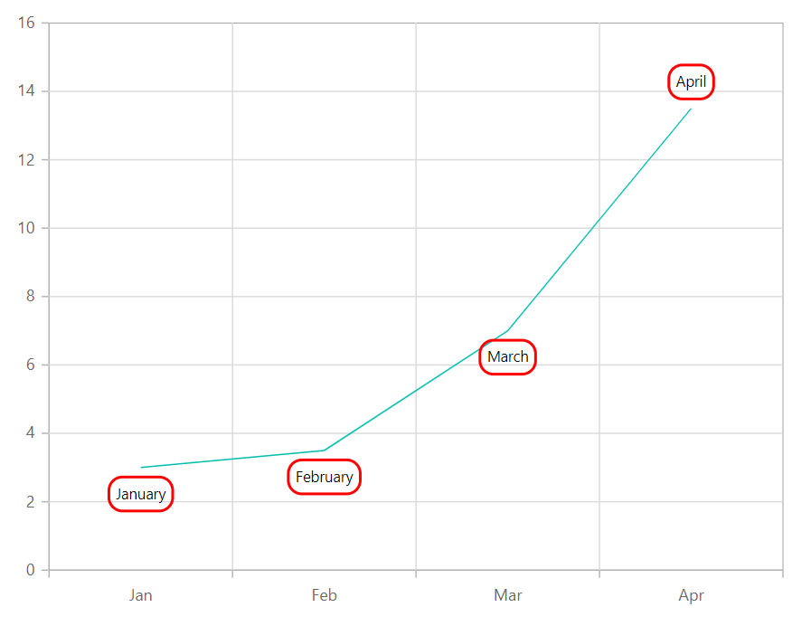

# Data Labels in Blazor Charts Component

[Data label](https://help.syncfusion.com/cr/blazor/Syncfusion.Blazor.Charts.ChartDataLabel.html) can be added to a [ChartSeries](https://help.syncfusion.com/cr/blazor/Syncfusion.Blazor.Charts.ChartSeries.html) by enabling the [Visible](https://help.syncfusion.com/cr/blazor/Syncfusion.Blazor.Charts.ChartDataLabel.html#Syncfusion_Blazor_Charts_ChartDataLabel_Visible) option in the data label settings. By default, the labels will organize themselves intelligently without overlapping.

```cshtml

@using Syncfusion.Blazor.Charts

<SfChart>
    <ChartPrimaryXAxis ValueType="Syncfusion.Blazor.Charts.ValueType.Category"/>

    <ChartSeriesCollection>
        <ChartSeries DataSource="@WeatherReports" XName="X" YName="Y" Type="ChartSeriesType.Column">
            <ChartMarker>
                <ChartDataLabel Visible="true"/>
            </ChartMarker>
        </ChartSeries>
    </ChartSeriesCollection>
</SfChart>

@code{
    public class Data
    {
        public string X { get; set; }
        public double Y { get; set; }
    }
	
    public List<Data> WeatherReports = new List<Data>
	{
        new Data{ X= "Jan", Y= 3 },
        new Data{ X= "Feb", Y= 3.5 },
        new Data{ X= "Mar", Y= 7 },
        new Data{ X= "Apr", Y= 13.5 }
    };
}

```


## Position

Using [Position](https://help.syncfusion.com/cr/blazor/Syncfusion.Blazor.Charts.ChartDataLabel.html#Syncfusion_Blazor_Charts_ChartDataLabel_Position) property, the label can be placed either on [Top](https://help.syncfusion.com/cr/blazor/Syncfusion.Blazor.Charts.LabelPosition.html#Syncfusion_Blazor_Charts_LabelPosition_Top), [Middle](https://help.syncfusion.com/cr/blazor/Syncfusion.Blazor.Charts.LabelPosition.html#Syncfusion_Blazor_Charts_LabelPosition_Middle), [Bottom](https://help.syncfusion.com/cr/blazor/Syncfusion.Blazor.Charts.LabelPosition.html#Syncfusion_Blazor_Charts_LabelPosition_Bottom) or [Outer](https://help.syncfusion.com/cr/blazor/Syncfusion.Blazor.Charts.LabelPosition.html#Syncfusion_Blazor_Charts_LabelPosition_Outer).

```cshtml

@using Syncfusion.Blazor.Charts

<SfChart>
    <ChartPrimaryXAxis ValueType="Syncfusion.Blazor.Charts.ValueType.Category" />

    <ChartSeriesCollection>
        <ChartSeries DataSource="@WeatherReports" XName="X" YName="Y" Type="ChartSeriesType.Column">
            <ChartMarker>
                <ChartDataLabel Visible="true" Position="Syncfusion.Blazor.Charts.LabelPosition.Middle" />
            </ChartMarker>
        </ChartSeries>
    </ChartSeriesCollection>
</SfChart>

@code{
    public class Data
    {
        public string X { get; set; }
        public double Y { get; set; }
    }
	
    public List<Data> WeatherReports = new List<Data>
    {
        new Data{ X= "Jan", Y= 3 },
        new Data{ X= "Feb", Y= 3.5 },
        new Data{ X= "Mar", Y= 7 },
        new Data{ X= "Apr", Y= 13.5 }
    };
}

```



> The position `Outer` is applicable only for column and bar series.

## Template

Label content can be formatted by using the [Template](https://help.syncfusion.com/cr/blazor/Syncfusion.Blazor.Charts.ChartDataLabel.html#Syncfusion_Blazor_Charts_ChartDataLabel_Template) option. Inside the template, one can add the placeholder text **${point.x}** and **${point.y}** to display the corresponding data point value.

## Text mapping

The [Name](https://help.syncfusion.com/cr/blazor/Syncfusion.Blazor.Charts.ChartDataLabel.html#Syncfusion_Blazor_Charts_ChartDataLabel_Name) property can be used to map text from a datasource to a data label.

```cshtml

@using Syncfusion.Blazor.Charts

<SfChart>
    <ChartPrimaryXAxis ValueType="Syncfusion.Blazor.Charts.ValueType.Category"></ChartPrimaryXAxis>

    <ChartSeriesCollection>
        <ChartSeries DataSource="@WeatherReports" XName="X" YName="Y" Type="ChartSeriesType.Column">
            <ChartMarker>
                <ChartDataLabel Visible="true" Name="Text"></ChartDataLabel>
            </ChartMarker>
        </ChartSeries>
    </ChartSeriesCollection>
</SfChart>

@code{
    public class Data
    {
        public string X { get; set; }
        public double Y { get; set; }
        public string Text { get; set; }
    }

    public List<Data> WeatherReports = new List<Data> 
	{
	   new Data{ X= "Jan", Y= 3, Text= "January" },
	   new Data{ X= "Feb", Y= 3.5, Text= "February" },
	   new Data{ X= "Mar", Y= 7, Text= "March" },
	   new Data{ X= "Apr", Y= 13.5, Text= "April" }
	};
}

```


## Margin

The [Margin](https://help.syncfusion.com/cr/blazor/Syncfusion.Blazor.Charts.ChartDataLabel.html#Syncfusion_Blazor_Charts_ChartDataLabel_Margin) option can be applied to the data label to create space around the element.

```cshtml

@using Syncfusion.Blazor.Charts

<SfChart>
    <ChartPrimaryXAxis ValueType="Syncfusion.Blazor.Charts.ValueType.Category"/>

    <ChartSeriesCollection>
        <ChartSeries DataSource="@WeatherReports" XName="X" YName="Y" Type="ChartSeriesType.Column">
            <ChartMarker>
                <ChartDataLabel Visible="true" Name="Text">
                    <ChartDataLabelBorder Width="2" Color="red"/>
                    <ChartDataLabelMargin Left="15" Right="15" Top="15" Bottom="15"/>
                </ChartDataLabel>
            </ChartMarker>
        </ChartSeries>
    </ChartSeriesCollection>
</SfChart>

@code{
    public class Data
    {
        public string X { get; set; }
        public double Y { get; set; }
        public string Text { get; set; }
    }

    public List<Data> WeatherReports = new List<Data> 
	{
	   new Data{ X= "Jan", Y= 3, Text= "January" },
	   new Data{ X= "Feb", Y= 3.5, Text= "February" },
	   new Data{ X= "Mar", Y= 7, Text= "March" },
	   new Data{ X= "Apr", Y= 13.5, Text= "April" }
	};
}

```


## Customization

Data label can be customized using [Fill](https://help.syncfusion.com/cr/blazor/Syncfusion.Blazor.Charts.ChartDataLabel.html#Syncfusion_Blazor_Charts_ChartDataLabel_Fill) property and the color and width of data label border can be customized based on the specified value in [ChartDataLabelBorder](https://help.syncfusion.com/cr/blazor/Syncfusion.Blazor.Charts.ChartDataLabelBorder.html). Rounded corners can also be applied using [Rx](https://help.syncfusion.com/cr/blazor/Syncfusion.Blazor.Charts.ChartDataLabel.html#Syncfusion_Blazor_Charts_ChartDataLabel_Rx) and [Ry](https://help.syncfusion.com/cr/blazor/Syncfusion.Blazor.Charts.ChartDataLabel.html#Syncfusion_Blazor_Charts_ChartDataLabel_Ry) properties.

```cshtml

@using Syncfusion.Blazor.Charts

<SfChart>
    <ChartPrimaryXAxis ValueType="Syncfusion.Blazor.Charts.ValueType.Category"/>   

    <ChartSeriesCollection>
        <ChartSeries DataSource="@WeatherReports" XName="X" YName="Y" >
            <ChartMarker>
                <ChartDataLabel Visible="true" Name="Text" Rx="10" Ry="10">
                    <ChartDataLabelBorder Width="2" Color="red"></ChartDataLabelBorder>
                </ChartDataLabel>
            </ChartMarker>
        </ChartSeries>
    </ChartSeriesCollection>
</SfChart>

@code{
    public class Data
    {
        public string X { get; set; }
        public double Y { get; set; }
        public string Text { get; set; }
    }

    public List<Data> WeatherReports = new List<Data> 
	{
	   new Data{ X= "Jan", Y= 3, Text= "January" },
	   new Data{ X= "Feb", Y= 3.5, Text= "February" },
	   new Data{ X= "Mar", Y= 7, Text= "March" },
	   new Data{ X= "Apr", Y= 13.5, Text= "April" }
	};
}

```



> Refer to our [Blazor Charts](https://www.syncfusion.com/blazor-components/blazor-charts) feature tour page for its groundbreaking feature representations and also explore our [Blazor Chart Example](https://blazor.syncfusion.com/demos/chart/line?theme=bootstrap4) to know various chart types and how to represent time-dependent data, showing trends at equal intervals.

## See Also

* [Tooltip](./tool-tip)
* [Legend](./legend)