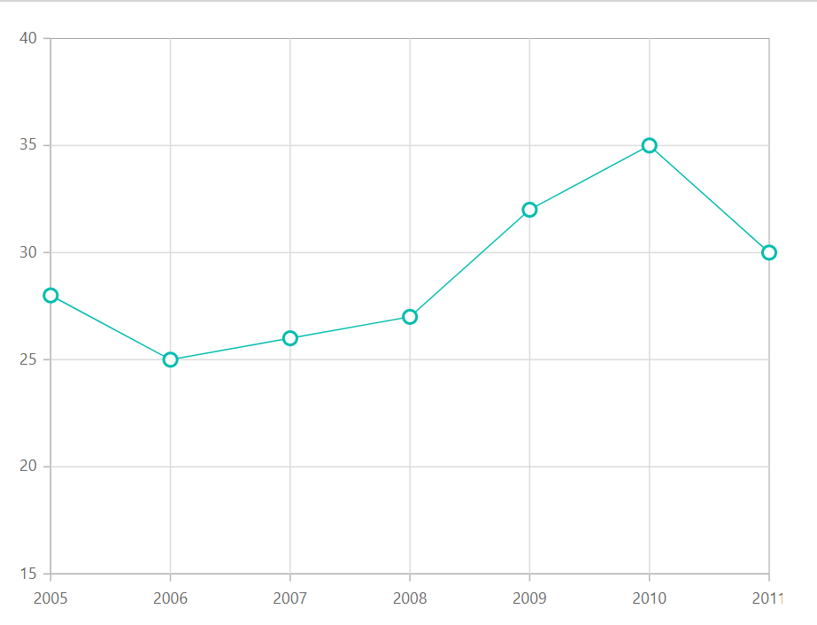

# Markers in Blazor Charts Component

[Data markers](https://help.syncfusion.com/cr/blazor/Syncfusion.Blazor.Charts.ChartCommonMarker.html) are used to provide information about the data points in a series. Each data point can be adorned with a shape.

<!-- markdownlint-disable MD036 -->

## Markers

<!-- markdownlint-disable MD036 -->

Markers can be added to the points by enabling the [Visible](https://help.syncfusion.com/cr/blazor/Syncfusion.Blazor.Charts.ChartCommonMarker.html#Syncfusion_Blazor_Charts_ChartCommonMarker_Visible) property to **true** of [ChartMarker](https://help.syncfusion.com/cr/blazor/Syncfusion.Blazor.Charts.ChartMarker.html).

```cshtml

@using Syncfusion.Blazor.Charts

<SfChart>
    <ChartSeriesCollection>
        <ChartSeries DataSource="@ConsumerReports" XName="X" YName="Y" Type="ChartSeriesType.Line">
            <ChartMarker Visible="true" Height="10" Width="10"/>            
        </ChartSeries>
    </ChartSeriesCollection>
</SfChart>

@code{
    public class ChartData
    {
        public double X { get; set; }
        public double Y { get; set; }
    }

    public List<ChartData> ConsumerReports = new List<ChartData>
	{
		new ChartData{ X= 2005, Y= 28 },
		new ChartData{ X= 2006, Y= 25 },
		new ChartData{ X= 2007, Y= 26 },
		new ChartData{ X= 2008, Y= 27 },
		new ChartData{ X= 2009, Y= 32 },
		new ChartData{ X= 2010, Y= 35 },
		new ChartData{ X= 2011, Y= 30 }
	};
}

```



## Shape

Markers can be assigned with different shapes such as [Rectangle](https://help.syncfusion.com/cr/blazor/Syncfusion.Blazor.Charts.ChartShape.html#Syncfusion_Blazor_Charts_ChartShape_Rectangle), [Circle](https://help.syncfusion.com/cr/blazor/Syncfusion.Blazor.Charts.ChartShape.html#Syncfusion_Blazor_Charts_ChartShape_Circle), [Diamond](https://help.syncfusion.com/cr/blazor/Syncfusion.Blazor.Charts.ChartShape.html#Syncfusion_Blazor_Charts_ChartShape_Diamond) etc. using the [Shape](https://help.syncfusion.com/cr/blazor/Syncfusion.Blazor.Charts.ChartCommonMarker.html#Syncfusion_Blazor_Charts_ChartCommonMarker_Shape) property.

```cshtml

@using Syncfusion.Blazor.Charts

<SfChart>
    <ChartSeriesCollection>
        <ChartSeries DataSource="@ConsumerReports" XName="X" YName="Y" Type="ChartSeriesType.Line">
            <ChartMarker Visible="true" Height="10" Width="10" Shape="ChartShape.Diamond"/>            
        </ChartSeries>
    </ChartSeriesCollection>
</SfChart>

@code{
    public class ChartData
    {
        public double X { get; set; }
        public double Y { get; set; }
    }

    public List<ChartData> ConsumerReports = new List<ChartData>
	{
		new ChartData{ X= 2005, Y= 28 },
		new ChartData{ X= 2006, Y= 25 },
		new ChartData{ X= 2007, Y= 26 },
		new ChartData{ X= 2008, Y= 27 },
		new ChartData{ X= 2009, Y= 32 },
		new ChartData{ X= 2010, Y= 35 },
		new ChartData{ X= 2011, Y= 30 }
	};
}

```


## Images

Apart from shapes, one can also add custom images to mark the data point using the [ImageUrl](https://help.syncfusion.com/cr/blazor/Syncfusion.Blazor.Charts.ChartCommonMarker.html#Syncfusion_Blazor_Charts_ChartCommonMarker_ImageUrl) property.

```cshtml

@using Syncfusion.Blazor.Charts

<SfChart>
    <ChartSeriesCollection>
        <ChartSeries DataSource="@ConsumerReports" XName="X" YName="Y" Type="ChartSeriesType.Line">
            <ChartMarker Visible="true" Height="10" Width="10" ImageUrl="https://ej2.syncfusion.com/demos/src/chart/images/cloud.png">
            </ChartMarker>
        </ChartSeries>
    </ChartSeriesCollection>
</SfChart>

@code{
    public class ChartData
    {
        public double X { get; set; }
        public double Y { get; set; }
    }

    public List<ChartData> ConsumerReports = new List<ChartData>
	{
		new ChartData{ X= 2005, Y= 28 },
		new ChartData{ X= 2006, Y= 25 },
		new ChartData{ X= 2007, Y= 26 },
		new ChartData{ X= 2008, Y= 27 },
		new ChartData{ X= 2009, Y= 32 },
		new ChartData{ X= 2010, Y= 35 },
		new ChartData{ X= 2011, Y= 30 }
	};
}

```

## Customization

Markers color can be customized using [Fill](https://help.syncfusion.com/cr/blazor/Syncfusion.Blazor.Charts.ChartCommonMarker.html#Syncfusion_Blazor_Charts_ChartCommonMarker_Fill) property and the border color and width can be customized based on the specified value in [ChartMarkerBorder](https://help.syncfusion.com/cr/blazor/Syncfusion.Blazor.Charts.ChartMarkerBorder.html).

```cshtml

@using Syncfusion.Blazor.Charts

<SfChart>
    <ChartPrimaryXAxis ValueType="Syncfusion.Blazor.Charts.ValueType.Category">
    </ChartPrimaryXAxis>

    <ChartSeriesCollection>
        <ChartSeries DataSource="@ConsumerReports" XName="X" YName="Y" Type="ChartSeriesType.Line">
            <ChartMarker Visible="true" Height="10" Width="10" Fill="red">
                <ChartMarkerBorder Width="2" Color="blue"></ChartMarkerBorder>
            </ChartMarker>
        </ChartSeries>
    </ChartSeriesCollection>
</SfChart>

@code{
    public class ChartData
    {
        public double X { get; set; }
        public double Y { get; set; }
    }

    public List<ChartData> ConsumerReports = new List<ChartData>
	{
		new ChartData{ X= 2005, Y= 28 },
		new ChartData{ X= 2006, Y= 25 },
		new ChartData{ X= 2007, Y= 26 },
		new ChartData{ X= 2008, Y= 27 },
		new ChartData{ X= 2009, Y= 32 },
		new ChartData{ X= 2010, Y= 35 },
		new ChartData{ X= 2011, Y= 30 }
	};
}

```


> Refer to our [Blazor Charts](https://www.syncfusion.com/blazor-components/blazor-charts) feature tour page for its groundbreaking feature representations and also explore our [Blazor Chart Example](https://blazor.syncfusion.com/demos/chart/line?theme=bootstrap4) to know various chart types and how to represent time-dependent data, showing trends at equal intervals.

## See Also

* [Tooltip](./tool-tip)
* [Legend](./legend)