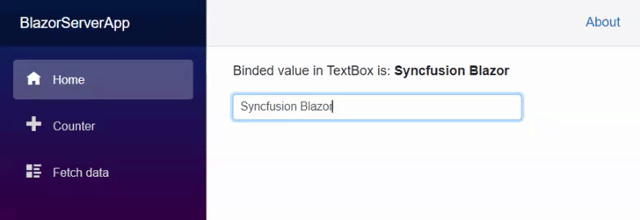

# Two-Way Data Binding

Two-way Binding is a bi-directional data flow. In two-way binding, data passes from the component to the UI and from the UI to the component class. Two-Way Binding support can be enabled for Syncfusion Blazor components by using `bind-Value` attribute. By default, the `bind-value` attribute binds the data value in the `OnChange` event. The `OnChange` event triggers when the element loses its focus.

## Syncfusion Blazor components that support Two-Way Binding

The following components support Two-Way Binding in Syncfusion Blazor components:

* [AutoComplete](https://blazor.syncfusion.com/documentation/autocomplete/data-binding)
* [Calendar](https://blazor.syncfusion.com/documentation/calendar/data-binding)
* [ComboBox](https://blazor.syncfusion.com/documentation/combobox/data-binding)
* [DatePicker](https://blazor.syncfusion.com/documentation/datepicker/data-binding)
* [DateRange Picker](https://blazor.syncfusion.com/documentation/daterangepicker/data-binding)
* [DateTime Picker](https://blazor.syncfusion.com/documentation/datetime-picker/data-binding)
* [DropDown List](https://blazor.syncfusion.com/documentation/dropdown-list/data-binding)
* [InPlace Editor](https://blazor.syncfusion.com/documentation/in-place-editor/data-binding)
* [Input Mask](https://blazor.syncfusion.com/documentation/input-mask/data-binding)
* [MultiSelect Dropdown](https://blazor.syncfusion.com/documentation/multiselect-dropdown/data-binding)
* [Numeric TextBox](https://blazor.syncfusion.com/documentation/numeric-textbox/data-binding)
* [RichTextEditor](https://blazor.syncfusion.com/documentation/rich-text-editor/data-binding)
* [Splitter](https://blazor.syncfusion.com/documentation/splitter/two-way-binding)
* [TextBox](https://blazor.syncfusion.com/documentation/textbox/data-binding)
* [TimePicker](https://blazor.syncfusion.com/documentation/timepicker/data-binding)

## Enable Two-Way Binding to individual component

To perform a Two-Way Binding operation, add the `bind-Value` attribute to the Syncfusion Blazor components. For illustration, the `bind-Value` attribute is added to the Syncfusion Blazor TextBox component and binds a property to the `bind-Value` attribute.

If the component value has been changed, it will affect all the places where you bind the property for the `bind-value` attribute.

```cshtml

@using Syncfusion.Blazor.Inputs

<p>Binded value in TextBox is: <b>@textValue</b></p>

<SfTextBox @bind-Value="textValue"></SfTextBox>

@code {
    private string textValue { get; set; }

    protected override void OnInitialized()
    {
        textValue = "Syncfusion Blazor";
    }
}

```

The following image represents the Two-Way Binding in Syncfusion Blazor TextBox component.


