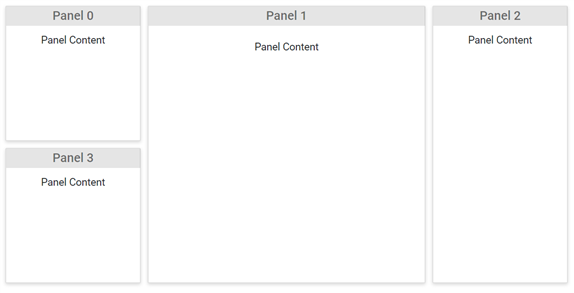

# Header and Content in Blazor Dashboard Layout Component

Basically, Dashboard layout Component have two templates to render the data in panels.

* ContentTemplate: To render data or any HTML template as the content.
* HeaderTemplate: A word or phrase that summarizes the panel’s content can be added as the header on the top of each panel.

```cshtml

@using Syncfusion.Blazor.Layouts

<SfDashboardLayout CellSpacing="@(new double[]{10 ,10 })" Columns="5">
    <DashboardLayoutPanels>
        <DashboardLayoutPanel>
            <HeaderTemplate><div>Panel 0</div></HeaderTemplate>
            <ContentTemplate><div>Panel Content</div></ContentTemplate>
        </DashboardLayoutPanel>
        <DashboardLayoutPanel SizeX=2 SizeY=2 Column=1>
            <HeaderTemplate><div>Panel 1</div></HeaderTemplate>
            <ContentTemplate><div>Panel Content</div></ContentTemplate>
        </DashboardLayoutPanel>
        <DashboardLayoutPanel SizeY=2 Column=3>
            <HeaderTemplate><div>Panel 2</div></HeaderTemplate>
            <ContentTemplate><div>Panel Content</div></ContentTemplate>
        </DashboardLayoutPanel>
        <DashboardLayoutPanel Row=1>
            <HeaderTemplate><div>Panel 3</div></HeaderTemplate>
            <ContentTemplate><div>Panel Content</div></ContentTemplate>
        </DashboardLayoutPanel>
    </DashboardLayoutPanels>
</SfDashboardLayout>

<style>
    .e-panel-header {
        background-color: rgba(0, 0, 0, .1);
        text-align: center;
    }
    .e-panel-content {
        text-align: center;
        margin-top: 10px;
    }
</style>

```

The following output demonstrates the Header and content of Panels using templates.

