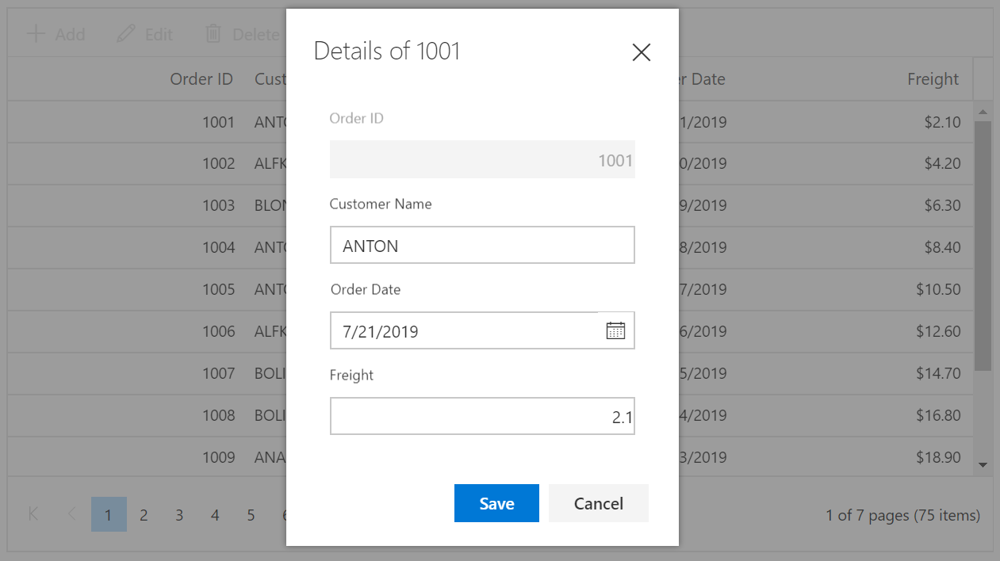

# Dialog Editing in Blazor DataGrid Component

In dialog edit mode, when you start editing the currently selected row data will be shown on a dialog. You can change the cell values and save edited data to the data source. To enable Dialog edit, set the [EditSettings.Mode](https://help.syncfusion.com/cr/blazor/Syncfusion.Blazor.Grids.GridEditSettings.html#Syncfusion_Blazor_Grids_GridEditSettings_Mode) as **Dialog**.

```cshtml
@using Syncfusion.Blazor.Grids

<SfGrid DataSource="@Orders" AllowPaging="true" Toolbar="@(new List<string>() { "Add", "Edit", "Delete", "Update", "Cancel" })" Height="315">
    <GridEditSettings AllowAdding="true" AllowEditing="true" AllowDeleting="true" Mode="EditMode.Dialog"></GridEditSettings>
    <GridColumns>
        <GridColumn Field=@nameof(Order.OrderID) HeaderText="Order ID" IsPrimaryKey="true" ValidationRules="@(new ValidationRules{ Required=true})" TextAlign="TextAlign.Right" Width="120"></GridColumn>
        <GridColumn Field=@nameof(Order.CustomerID) HeaderText="Customer Name" ValidationRules="@(new ValidationRules{ Required=true})" Width="120"></GridColumn>
        <GridColumn Field=@nameof(Order.OrderDate) HeaderText=" Order Date" EditType="EditType.DatePickerEdit" Format="d" TextAlign="TextAlign.Right" Width="130" Type="ColumnType.Date"></GridColumn>
        <GridColumn Field=@nameof(Order.Freight) HeaderText="Freight" Format="C2" TextAlign="TextAlign.Right" EditType="EditType.NumericEdit" Width="120"></GridColumn>
        <GridColumn Field=@nameof(Order.ShipCountry) HeaderText="Ship Country" EditType="EditType.DropDownEdit" Width="150"></GridColumn>
    </GridColumns>
</SfGrid>

@code{
    public List<Order> Orders { get; set; }

    protected override void OnInitialized()
    {
        Orders = Enumerable.Range(1, 75).Select(x => new Order()
        {
            OrderID = 1000 + x,
            CustomerID = (new string[] { "ALFKI", "ANANTR", "ANTON", "BLONP", "BOLID" })[new Random().Next(5)],
            Freight = 2.1 * x,
            OrderDate = DateTime.Now.AddDays(-x),
            ShipCountry = (new string[] { "USA", "UK", "CHINA", "RUSSIA", "INDIA" })[new Random().Next(5)]
        }).ToList();
    }

    public class Order
    {
        public int? OrderID { get; set; }
        public string CustomerID { get; set; }
        public DateTime? OrderDate { get; set; }
        public double? Freight { get; set; }
        public string ShipCountry { get; set; }
    }
}

```

The following screenshot represents Editing in Dialog Mode.


## Customize the edit dialog

You can use [HeaderTemplate](https://help.syncfusion.com/cr/blazor/Syncfusion.Blazor.Grids.GridEditSettings.html#Syncfusion_Blazor_Grids_GridEditSettings_HeaderTemplate) and [FooterTemplate](https://help.syncfusion.com/cr/blazor/Syncfusion.Blazor.Grids.GridEditSettings.html#Syncfusion_Blazor_Grids_GridEditSettings_FooterTemplate) of the [GridEditSettings](https://help.syncfusion.com/cr/blazor/Syncfusion.Blazor.Grids.GridEditSettings.html) component to customize the appearance of edit dialog.

In the below example we have changed the dialog's header text and footer button content for editing and adding records.

```cshtml
@using Syncfusion.Blazor.Buttons
@using Syncfusion.Blazor.Grids

<SfGrid @ref="Grid" DataSource="@Orders" AllowPaging="true" Toolbar="@(new List<string>() { "Add", "Edit", "Delete", "Update", "Cancel" })" Height="315">
    <GridEditSettings AllowAdding="true" AllowEditing="true" AllowDeleting="true" Mode="EditMode.Dialog">
        <HeaderTemplate>
            @{
                var text = GetHeader((context as Order));
                <span>@text</span>
            }
        </HeaderTemplate>
        <FooterTemplate>
            <SfButton OnClick="@Save" IsPrimary="true">@ButtonText</SfButton>
            <SfButton OnClick="@Cancel">Cancel</SfButton>
        </FooterTemplate>
    </GridEditSettings>
    <GridColumns>
        <GridColumn Field=@nameof(Order.OrderID) HeaderText="Order ID" IsPrimaryKey="true" ValidationRules="@(new ValidationRules { Required = true })" TextAlign="TextAlign.Right" Width="120"></GridColumn>
        <GridColumn Field=@nameof(Order.CustomerID) HeaderText="Customer Name" ValidationRules="@(new ValidationRules { Required = true })" Width="120"></GridColumn>
        <GridColumn Field=@nameof(Order.OrderDate) HeaderText=" Order Date" EditType="EditType.DatePickerEdit" Format="d" TextAlign="TextAlign.Right" Width="130" Type="ColumnType.Date"></GridColumn>
        <GridColumn Field=@nameof(Order.Freight) HeaderText="Freight" Format="C2" TextAlign="TextAlign.Right" EditType="EditType.NumericEdit" Width="120"></GridColumn>
        <GridColumn Field=@nameof(Order.ShipCountry) HeaderText="Ship Country" EditType="EditType.DropDownEdit" Width="150"></GridColumn>
    </GridColumns>
</SfGrid>

@code{
    SfGrid<Order> Grid { get; set; }
    public List<Order> Orders { get; set; }
    public string Header { get; set; }
    public string ButtonText { get; set; }
    public string GetHeader(Order Value)
    {
        if (Value.OrderID == null)
        {
            ButtonText = "Insert";
            return "Insert New Order";
        }
        else
        {
            ButtonText = "Save Changes";
            return "Edit Record Details of " + Value.OrderID.ToString();
        }
    }
    public async Task Cancel()
    {
        await Grid.CloseEdit();     //Cancel editing action
    }
    public async Task Save()
    {
        await Grid.EndEdit();       //Save the edited/added data to Grid
    }
    protected override void OnInitialized()
    {
        Orders = Enumerable.Range(1, 75).Select(x => new Order()
        {
            OrderID = 1000 + x,
            CustomerID = (new string[] { "ALFKI", "ANANTR", "ANTON", "BLONP", "BOLID" })[new Random().Next(5)],
            Freight = 2.1 * x,
            OrderDate = DateTime.Now.AddDays(-x),
            ShipCountry = (new string[] { "USA", "UK", "CHINA", "RUSSIA", "INDIA" })[new Random().Next(5)]
        }).ToList();
    }

    public class Order
    {
        public int? OrderID { get; set; }
        public string CustomerID { get; set; }
        public DateTime? OrderDate { get; set; }
        public double? Freight { get; set; }
        public string ShipCountry { get; set; }
    }
}
```

> You can refer to our [Blazor DataGrid](https://www.syncfusion.com/blazor-components/blazor-datagrid) feature tour page for its groundbreaking feature representations. You can also explore our [Blazor DataGrid example](https://blazor.syncfusion.com/demos/datagrid/overview?theme=bootstrap4) to understand how to present and manipulate data.

## Add the default PreventRender value for dialog editing/adding

By default, we have prevented the unnecessary rendering of the Grid component on an external StateHasChanged call. Due to this, any changes made in the Grid Add/Edit dialog form will not reflect changes that are executed dynamically or externally. To dynamically re-render the Grid's Add/Edit form to reflect the changes, we must call the Grid's PreventRender() method with a false argument.

In the following sample, we have rendered the checkbox component in a dialog edit form. By calling the PreventRender() method with a false argument in the [OnActionComplete](https://help.syncfusion.com/cr/blazor/Syncfusion.Blazor.Grids.GridEvents-1.html#Syncfusion_Blazor_Grids_GridEvents_1_OnActionComplete) event, we can update the checkbox component state.

```cshtml
@using Syncfusion.Blazor.Buttons
@using Syncfusion.Blazor.Grids

<div class="form-group">
    <SfCheckBox Label="Option 1" @bind-Checked="@FirstOption"
                Disabled="SecondOption || ThirdOption" />
</div>
<div class="form-group">
    <SfCheckBox Label="Option 2" @bind-Checked="@SecondOption"
                Disabled="FirstOption || ThirdOption" />
</div>
<div class="form-group">
    <SfCheckBox Label="Option 3" @bind-Checked="@ThirdOption"
                Disabled="FirstOption || SecondOption" />
</div>


<div>
    <SfGrid @ref="MyGrid"
            DataSource="MyOptList ?? new List<Options>()"
            TValue="Options"
            Toolbar="@(new List<string>() { "Add", "Edit", "Delete", "Update" })">
        <GridEvents TValue="Options" OnActionComplete="ActionComplete"></GridEvents>
        <GridEditSettings AllowAdding="true"
                          AllowEditing="true"
                          Mode="EditMode.Dialog">
            <Template>
                @{
                    Options MyOpts = (context as Options);
                }
                <div class="form-group">
                    <SfCheckBox Label="Option 1" @bind-Checked="@MyOpts.FirstOption"
                                Disabled="MyOpts.SecondOption || MyOpts.ThirdOption" />
                </div>
                <div class="form-group">
                    <SfCheckBox Label="Option 2" @bind-Checked="@MyOpts.SecondOption"
                                Disabled="MyOpts.FirstOption || MyOpts.ThirdOption" />
                </div>
                <div class="form-group">
                    <SfCheckBox Label="Option 3" @bind-Checked="@MyOpts.ThirdOption"
                                Disabled="MyOpts.FirstOption || MyOpts.SecondOption" />
                </div>
            </Template>
        </GridEditSettings>
        <GridColumns>
            <GridColumn Field="@nameof(Options.FirstOption)" HeaderText="First" />
            <GridColumn Field="@nameof(Options.SecondOption)" HeaderText="Second" />
            <GridColumn Field="@nameof(Options.ThirdOption)" HeaderText="Third" />
        </GridColumns>
    </SfGrid>
</div>

@code{
    public SfGrid<Options> MyGrid { get; set; }

    public class Options
    {
        public bool FirstOption { get; set; } = false;
        public bool SecondOption { get; set; } = false;
        public bool ThirdOption { get; set; } = false;
    }

    public List<Options> MyOptList = new List<Options>()
    {
        new Options(),
        new Options(),
        new Options()
    };

    public void ActionComplete(ActionEventArgs<Options> args)
    {
        if (args.RequestType.Equals(Syncfusion.Blazor.Grids.Action.Add) || args.RequestType.Equals(Syncfusion.Blazor.Grids.Action.BeginEdit))
        {
            MyGrid.PreventRender(false);
        }
    }

    public bool FirstOption = false;
    public bool SecondOption = false;
    public bool ThirdOption = false;
}
```

>  Commenting the PreventRender method in the OnActionComplete event will result in the failure to update the Checkbox component state.