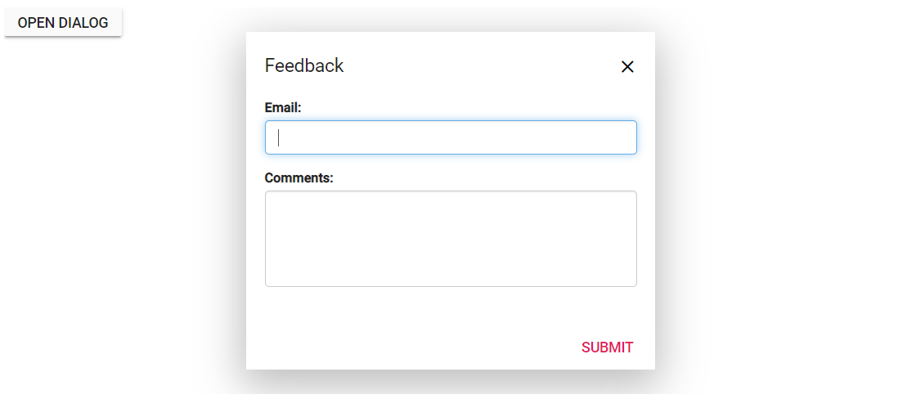

# Accessibility in Blazor Dialog Component

The Dialog is characterized with complete ARIA Accessibility support which makes it accessible to on-screen readers and other assistive technology devices. This component is designed with the reference of the guidelines document given in [WAI ARAI Accessibility Practices](https://www.w3.org/TR/wai-aria-practices-1.1/#dialog_modal).

The Dialog component uses the `Dialog` role and following ARIA properties to its element based on its state.

| **Property** | **Functionalities** |
| --- | --- |
| aria-describedby | Indicates that the Dialog content description is notified to the users through assistive technologies. |
| aria-labelledby | The Dialog title is notified to the users through assistive technologies. |
| aria-modal | For modal dialog, it's value is true and non-modal dialog its value is false |
| aria-grabbed | Enables the draggable Dialog and starts dragging if its value is true and stops dragging if its value is false. |

## Keyboard interaction

Keyboard interaction of Dialog component has been designed based on [WAI-ARIA Practices](https://www.w3.org/TR/wai-aria-practices-1.1/#dialog_modal) described for Dialog. User can use the following shortcut keys to interact with the Dialog.

<!-- markdownlint-disable MD033 -->
<table>
<tr>
<td>
<b>Keyboard shortcuts</b></td><td>
<b>Actions</b></td></tr>
<tr>
<td>
<kbd>Esc</kbd></td><td>
Closes the Dialog. This functionality can be controlled by using <b>closeOnEscape</b></td></tr>
<tr>
<td>
<kbd>Enter</kbd></td><td>
When the Dialog button or any input (except text area) is in focus state, when
pressing the Enter key, the click event associated with the primary button or button will
trigger. Enter key does not work when the Dialog content contains any text area with
initial focus</td></tr>
<tr>
<td>
<kbd>Ctrl + Enter</kbd></td><td>
When the Dialog content contains text area and it is in focus state, press the Ctrl + Enter
key to call the click event
function associated with primary button</td></tr>
<tr>
<td>
<kbd>Tab</kbd></td><td>
Focus will be changed within the Dialog elements</td></tr>
<tr>
<td>
<kbd>Shift + Tab</kbd></td><td>
The Focus will be changed previous focusable element within the Dialog elements. When focusing a
first focusable element in the Dialog, then press the shift + tab key, it will change the focus
to last focusable element</td></tr>
</table>

```cshtml

@using Syncfusion.Blazor.Popups
@using Syncfusion.Blazor.Buttons

<SfButton @onclick="@OpenDialog">Open Dialog</SfButton>

<SfDialog Width="400px" Height="358px" ShowCloseIcon="true" @bind-Visible="@IsVisible">
    <DialogTemplates>
        <Header>
            <div>Feedback</div>
        </Header>
        <Content>
            <form>
                <div class='form-group'>
                    <label for='email'>Email:</label>
                    <input type='email' class='form-control' id='email'>
                </div>
                <div class='form-group'></div>
                <div class='form-group'>
                    <label for='comment'>Comments:</label>
                    <textarea style='resize: none;' class='form-control' rows='4' id='comment'></textarea>
                </div>
            </form>
        </Content>
    </DialogTemplates>
    <DialogButtons>
        <DialogButton Content="Submit" IsPrimary="true" OnClick="@CloseDialog" />
    </DialogButtons>
</SfDialog>

@code {
    private bool IsVisible { get; set; } = true;

    private void OpenDialog()
    {
        this.IsVisible = true;
    }

    private void CloseDialog()
    {
        this.IsVisible = false;
    }
}

```

The output will be as follows.



## See Also

* [Show dialog with fullscreen](./how-to/show-dialog-with-fullscreen)