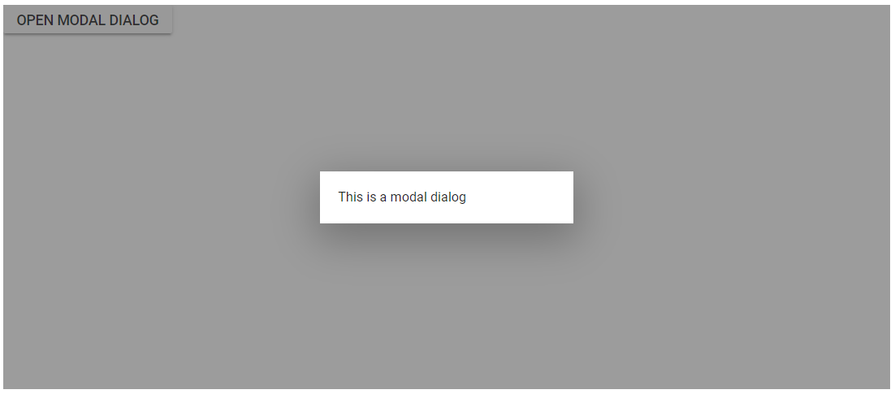
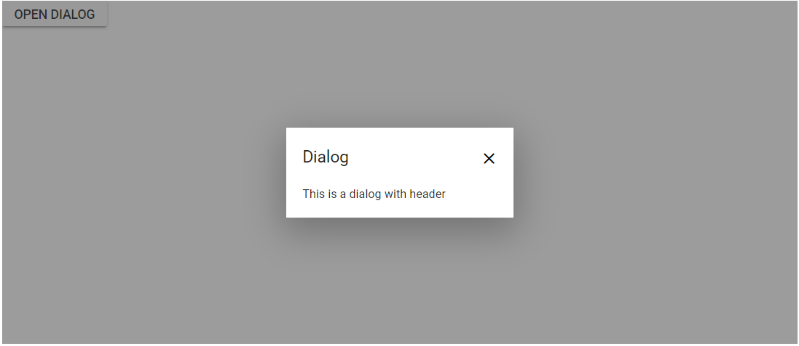
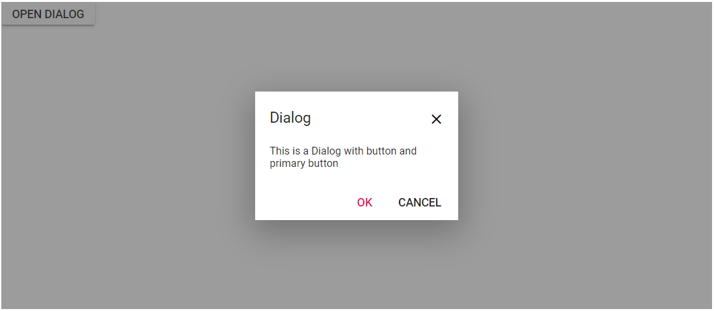

# Getting Started with Blazor Dialog Component

This section briefly explains how to include a Dialog component in your Blazor Server-side application. You can refer to our Getting Started with [Syncfusion Blazor Server-Side Popups in Visual Studio page](../getting-started/blazor-server-side-visual-studio/) for the introduction and configuring the common specifications.

To get start quickly with Blazor Dialog component, you can check on this video:


## Importing Syncfusion Blazor component in the application

* Install **Syncfusion.Blazor.Popups** NuGet package to the application by using the **NuGet Package Manager**.

* You can add the client-side resources through [CDN](https://blazor.syncfusion.com/documentation/appearance/themes#cdn-reference) or from [NuGet](https://blazor.syncfusion.com/documentation/appearance/themes#static-web-assets) package in the **HEAD** element of the **~/Pages/_Host.cshtml** page.

```cshtml

<head>
  <environment include="Development">
  ....
  ....
    <link href="_content/Syncfusion.Blazor/styles/fabric.css" rel="stylesheet" />
    <!---CDN--->
    @*<link href="https://cdn.syncfusion.com/blazor/18.4.42/styles/fabric.css" rel="stylesheet" />*@
  </environment>
</head>

```

> For Internet Explorer 11 kindly refer the polyfills. Refer the [documentation](../common/how-to/render-blazor-server-app-in-ie/) for more information.

```cshtml

<head>
   <environment include="Development">
      <link href="_content/Syncfusion.Blazor/styles/fabric.css" rel="stylesheet" />
      <script src="https://github.com/Daddoon/Blazor.Polyfill/releases/download/3.0.1/blazor.polyfill.min.js"></script>
  </environment>
</head>

```

## Adding component package to the application

Open **~/_Imports.razor** file and import the **Syncfusion.Blazor.Popups** package.

```cshtml

@using Syncfusion.Blazor.Popups

```

## Add SyncfusionBlazor service in Startup.cs

Open the **Startup.cs** file and add services required by Syncfusion components using **services.AddSyncfusionBlazor()** method. Add this method in the **ConfigureServices** function as follows.

```csharp

using Syncfusion.Blazor;
namespace BlazorApplication
{
    public class Startup
    {
        ....
        ....
        public void ConfigureServices(IServiceCollection services)
        {
            ....
            ....
            services.AddSyncfusionBlazor();
        }
    }
}

```

## Add Dialog component

To initialize the Dialog component, add the below code to your **Index.razor** view page which is present under **~/Pages** folder.

The following code explains how to initialize a simple Dialog in Razor page.

```cshtml

@using Syncfusion.Blazor.Popups

<SfDialog Width="250px">
    <DialogTemplates>
        <Content> This is a Dialog with content </Content>
    </DialogTemplates>
</SfDialog>

```

## Run the application

After successful compilation of your application, simply run the application.

The output will be as follows.


> * In the dialog control, max-height is calculated based on the dialog target element height. If the **Target** property is not configured, the **document.body** is considered as a target. Therefore, to show a dialog in proper height, you need to add min-height to the target element.
> * If the dialog is rendered based on the body, then the dialog will get the height based on its body element height. If the height of the dialog is larger than the body height, then the dialog's height will not be set. For this scenario, we can set the CSS style for the html and body to get the dialog height.

```css

html, body {
   height: 100%;
}

```

## Prerender the dialog

The dialog component is maintained at the DOM elements when showing or hiding the dialogs while enabling the `AllowPrerender` property.

> By default, the `AllowPrerender` property is in disabled state. The dialog DOM elements will be destroyed while hiding the dialog. Each time the dialog will be re-rendered when showing the dialog. Dialog `@bind-Visible` property also works based on the `AllowPrerender` property.

```cshtml

@using Syncfusion.Blazor.Popups
@using Syncfusion.Blazor.Buttons

<div id="target">
    <div>
        @if (this.ShowButton)
        {
            <button class="e-btn" @onclick="@OnBtnClick">Open</button>
        }
    </div>
    <SfDialog Target="#target" Width="300px" ShowCloseIcon="true" @bind-Visible="Visibility" AllowPrerender="true">
        <DialogTemplates>
            <Header> Dialog </Header>
            <Content> This is a dialog with header </Content>
        </DialogTemplates>
        <DialogEvents OnOpen="@DialogOpen" Closed="@DialogClose"></DialogEvents>
    </SfDialog>
</div>
<style>
    #target {
        height: 500px;
    }
</style>
@code {
    private bool Visibility { get; set; } = true;
    private bool ShowButton { get; set; } = false;
    private void OnBtnClick()
    {
        this.Visibility = true;
    }
    private void DialogOpen(Object args)
    {
        this.ShowButton = false;
    }
    private void DialogClose(Object args)
    {
        this.ShowButton = true;
    }
}

```

The output will be as follows.


## Modal dialog

A `modal` shows an overlay behind the Dialog. So, the users should interact the Dialog compulsory before interacting with the remaining content in an application.

While the user clicks the overlay, the action can be handled through the `OnOverlayClick` event. In the following code, it explains the Dialog close action performed while clicking the overlay.

```cshtml

@using Syncfusion.Blazor.Popups
@using Syncfusion.Blazor.Buttons

<SfButton @onclick="@OpenDialog">Open Modal Dialog</SfButton>

<SfDialog Width="250px" IsModal="true" @bind-Visible="@IsVisible">
    <DialogEvents OnOverlayClick="@OnOverlayclick">
    </DialogEvents>
    <DialogTemplates>
        <Content> This is a modal dialog </Content>
    </DialogTemplates>
</SfDialog>

@code {
    private bool IsVisible { get; set; } = true;

    private void OpenDialog()
    {
        this.IsVisible = true;
    }

    private void OnOverlayclick(MouseEventArgs arg)
    {
        this.IsVisible = false;
    }
}

```

The output will be as follows.



## Enable header

The Dialog header can be enabled by adding the header content as text or HTML content using the `Header` template of the dialog.

```cshtml

@using Syncfusion.Blazor.Popups
@using Syncfusion.Blazor.Buttons

<SfButton @onclick="@OpenDialog">Open Dialog</SfButton>

<SfDialog Width="250px" ShowCloseIcon="true" IsModal="true" @bind-Visible="@IsVisible">
    <DialogTemplates>
        <Header> Dialog </Header>
        <Content> This is a dialog with header </Content>
    </DialogTemplates>
</SfDialog>

@code {
    private bool IsVisible { get; set; } = true;

    private void OpenDialog()
    {
        this.IsVisible = true;
    }
}

```

The output will be as follows.



## Render Dialog with buttons

By adding the `DialogButtons` can render a Dialog with buttons in Razor page.

```cshtml

@using Syncfusion.Blazor.Popups
@using Syncfusion.Blazor.Buttons

<SfButton @onclick="@OpenDialog">Open Dialog</SfButton>

<SfDialog Width="250px" ShowCloseIcon="true" IsModal="true" @bind-Visible="@IsVisible">
    <DialogTemplates>
        <Header> Dialog </Header>
        <Content> This is a Dialog with button and primary button </Content>
    </DialogTemplates>
    <DialogButtons>
        <DialogButton Content="OK" IsPrimary="true" OnClick="@CloseDialog" />
        <DialogButton Content="Cancel" OnClick="@CloseDialog" />
    </DialogButtons>
</SfDialog>

@code {
    private bool IsVisible { get; set; } = true;

    private void OpenDialog()
    {
        this.IsVisible = true;
    }

    private void CloseDialog()
    {
        this.IsVisible = false;
    }
}

```

The output will be as follows.



## See Also

* [Getting Started with Syncfusion Blazor for client-side in .NET Core CLI](../getting-started/blazor-webassembly-dotnet-cli/)

* [Getting Started with Syncfusion Blazor for server-side in Visual Studio](../getting-started/blazor-server-side-visual-studio/)

* [Getting Started with Syncfusion Blazor for server-side in .NET Core CLI](../getting-started/blazor-server-side-dotnet-cli/)