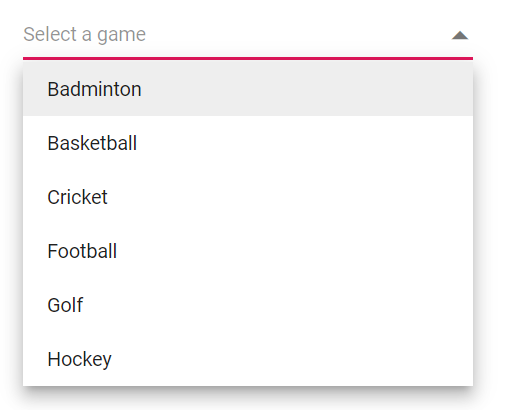
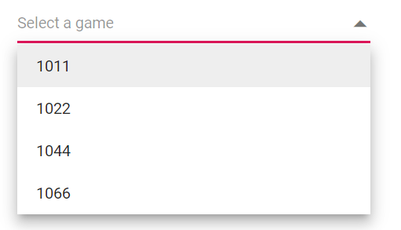
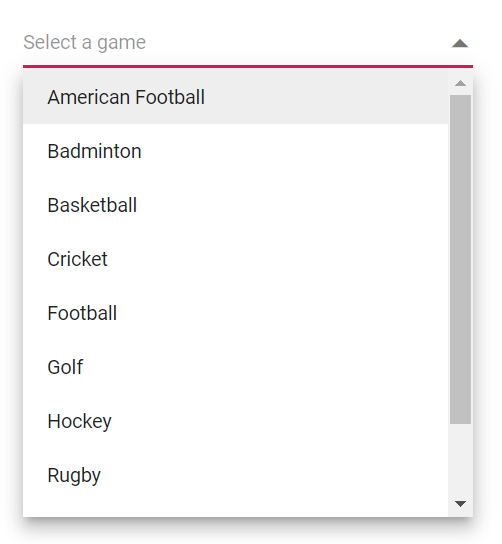
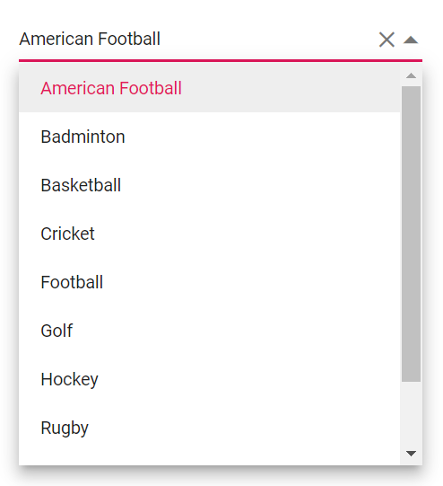

# Value Binding in Blazor DropDown List Component

The value binding as the process of passing values between a component and its parent. There are two methods for binding values, as shown below.

    * bind-Value Binding 
    * bind-Index Binding

## Bind Value Binding

Value binding can be achieved by using the [`@bind-Value`](https://help.syncfusion.com/cr/blazor/Syncfusion.Blazor.DropDowns.SfDropDownList-2.html#Syncfusion_Blazor_DropDowns_SfDropDownList_2_Value) attribute and it supports string, int, Enum, bool and complex types. If component value has been changed, it will affect the all places where you bind the variable for the bind-value attribute.

```csharp
@using Syncfusion.Blazor.DropDowns

<p>DropDownList value is:<strong>@DropVal</strong></p>

<SfDropDownList TValue="string" Placeholder="e.g. Australia" TItem="Countries" @bind-Value="@DropVal" DataSource="@Country">
    <DropDownListFieldSettings Value="Name"></DropDownListFieldSettings>
</SfDropDownList>

@code {

    public string DropVal;

    public class Countries
    {
        public string Name { get; set; }

        public string Code { get; set; }
    }

    List<Countries> Country = new List<Countries>
{
        new Countries() { Name = "Australia", Code = "AU" },
        new Countries() { Name = "Bermuda", Code = "BM" },
        new Countries() { Name = "Canada", Code = "CA" },
        new Countries() { Name = "Cameroon", Code = "CM" },
    };
}
```

## Index Value Binding

Index value binding can be achieved by using [`@bind-Index`](https://help.syncfusion.com/cr/blazor/Syncfusion.Blazor.DropDowns.SfDropDownList-2.html#Syncfusion_Blazor_DropDowns_SfDropDownList_2_Index) attribute and it supports int and int nullable types. By using this attribute you can bind the values respective to its index.

```csharp
@using Syncfusion.Blazor.DropDowns

<SfDropDownList TValue="string" TItem="Games" Width="300px" Placeholder="Select a game" DataSource="@LocalData" @bind-Index="@ddlIndex">
  <DropDownListFieldSettings Value="ID" Text="Game"></DropDownListFieldSettings>
</SfDropDownList>

@code {
    private int? ddlIndex { get; set; } = 1;
    public class Games
    {  
        public string ID { get; set; }
        public string Game { get; set; }
    }
    List<Games> LocalData = new List<Games> {
    new Games() { ID= "Game1", Game= "American Football" },
    new Games() { ID= "Game2", Game= "Badminton" },
    new Games() { ID= "Game3", Game= "Basketball" },
    new Games() { ID= "Game4", Game= "Cricket" },
    new Games() { ID= "Game5", Game= "Football" },
    new Games() { ID= "Game6", Game= "Golf" },
    new Games() { ID= "Game7", Game= "Hockey" },
    new Games() { ID= "Game8", Game= "Rugby"},
    new Games() { ID= "Game9", Game= "Snooker" },
    new Games() { ID= "Game10", Game= "Tennis"},
  };
}
```

## Text and Value

The [`Value`](https://help.syncfusion.com/cr/blazor/Syncfusion.Blazor.DropDowns.FieldSettingsModel.html#Syncfusion_Blazor_DropDowns_FieldSettingsModel_Value) field mapped to the component maintains the unique value of the item in the data source. The [`Text`](https://help.syncfusion.com/cr/blazor/Syncfusion.Blazor.DropDowns.FieldSettingsModel.html#Syncfusion_Blazor_DropDowns_FieldSettingsModel_Text) field used to display the text in the popup list items for the respective value. We can specify these properties within the `DropDownListFieldSettings` tag helper.

The following code demonstrates, Value and Text field of the DropDownList component For instance, the selected item is `Badminton` (Text Field i.e., Game) but the value field holds `Game2` (Value Field i.e., ID).

```csharp
@using Syncfusion.Blazor.DropDowns

<p>DropDownList Value is: @DropDownValue</p>

<SfDropDownList TValue="string" TItem="Games" Width="300px" Placeholder="Select a game" DataSource="@LocalData" @bind-Value="@DropDownValue">
  <DropDownListFieldSettings Value="ID" Text="Game"></DropDownListFieldSettings>
</SfDropDownList>

@code {
    public string DropDownValue { get; set; } = "Game2";
    public class Games
    {  
        public string ID { get; set; }
        public string Game { get; set; }
    }
    List<Games> LocalData = new List<Games> {
    new Games() { ID= "Game1", Game= "American Football" },
    new Games() { ID= "Game2", Game= "Badminton" },
    new Games() { ID= "Game3", Game= "Basketball" },
    new Games() { ID= "Game4", Game= "Cricket" },
    new Games() { ID= "Game5", Game= "Football" },
    new Games() { ID= "Game6", Game= "Golf" },
    new Games() { ID= "Game7", Game= "Hockey" },
    new Games() { ID= "Game8", Game= "Rugby"},
    new Games() { ID= "Game9", Game= "Snooker" },
    new Games() { ID= "Game10", Game= "Tennis"},
  };
}
```

The output will be as follows.


## Primitive Type Binding

You can bind the data to the DropDownList as a simple collection of string, int, double and bool type items.

The following code demonstrates array of string, double and integer values to the DropDownList component.

```csharp

<SfDropDownList TValue=string TItem=string Placeholder="Select a game" DataSource="@data" Width="300px"></SfDropDownList>

@code{
    public string[] data = { "Badminton", "Basketball", "Cricket", "Football", "Golf" ,"Hockey"};
}
```

The output will be as follows.



```csharp
@using Syncfusion.Blazor.DropDowns

<SfDropDownList TValue=int? TItem=int? Placeholder="Select a game" DataSource="@data" Width="300px"></SfDropDownList>

@code{
    public int?[] data = { 1011, 1022, 1044, 1066 };
}
```

The output will be as follows.



## Object Binding

The DropDownList can generate its list items through an array of complex data. For this, the appropriate columns should be mapped to the [Fields](https://help.syncfusion.com/cr/blazor/Syncfusion.Blazor.DropDowns.FieldSettingsModel.html) property.

In the following example, `Game` column from complex data has been mapped to the `Value` field.

```csharp
@using Syncfusion.Blazor.DropDowns

<SfDropDownList TValue="Games" TItem="Games" Width="300px" Placeholder="Select a game" DataSource="@LocalData">
  <DropDownListFieldSettings Value="ID" Text="Game"></DropDownListFieldSettings>
</SfDropDownList>

@code {
    public class Games
    {  
        public string ID { get; set; }
        public string Game { get; set; }
    }
    List<Games> LocalData = new List<Games> {
    new Games() { ID= "Game1", Game= "American Football" },
    new Games() { ID= "Game2", Game= "Badminton" },
    new Games() { ID= "Game3", Game= "Basketball" },
    new Games() { ID= "Game4", Game= "Cricket" },
    new Games() { ID= "Game5", Game= "Football" },
    new Games() { ID= "Game6", Game= "Golf" },
    new Games() { ID= "Game7", Game= "Hockey" },
    new Games() { ID= "Game8", Game= "Rugby"},
    new Games() { ID= "Game9", Game= "Snooker" },
    new Games() { ID= "Game10", Game= "Tennis"},
  };
}
```

The output will be as follows.



## Enum Binding

You can bind enum data to DropDownList component. The following code helps you get a string value from the enumeration data.

```csharp

@using Syncfusion.Blazor.DropDowns;

<SfDropDownList TValue="Values" TItem="string" Placeholder="e.g. Australia" DataSource="@EnumValues" @bind-Value="@ddlVal">
</SfDropDownList>

@code{

    public string[] EnumValues = Enum.GetNames(typeof(Values));
    public Values ddlVal { get; set; } = Values.Canada;

    public enum Values
    {
        Australia,
        Bermuda,
        Canada,
        Denmark,
        India,
        US

    }
}

```

The output will shown as follows,


## Show or Hide Clear Button

The [ShowClearButton](https://help.syncfusion.com/cr/blazor/Syncfusion.Blazor.DropDowns.SfDropDownList-2.html#Syncfusion_Blazor_DropDowns_SfDropDownList_2_ShowClearButton) property used to specifies whether to show or hide the clear button. When the clear button is clicked, `Value`, `Text`, and `Index` properties are reset to null.

> If the TValue is non nullable type, then while using clear button, it will set the default value of the data type. 

The below sample demonstrates `int` is used as `TValue`. So, if we clear the value using clear button, it will set to 0 as it's the default value of the respective type.


```csharp
@using Syncfusion.Blazor.DropDowns;

<SfDropDownList TValue="int?" TItem="Games" ShowClearButton=true Width="300px" Placeholder="Select a game" DataSource="@LocalData">
  <DropDownListFieldSettings Value="ID" Text="Game"></DropDownListFieldSettings>
</SfDropDownList>

@code {
    public class Games
    {  
        public int? ID { get; set; }
        public string Game { get; set; }
    }
    List<Games> LocalData = new List<Games> {
    new Games() { ID= 1, Game= "American Football" },
    new Games() { ID= 2, Game= "Badminton" },
    new Games() { ID= 3, Game= "Basketball" },
    new Games() { ID= 4, Game= "Cricket" },
    new Games() { ID= 5, Game= "Football" },
    new Games() { ID= 6, Game= "Golf" },
    new Games() { ID= 7, Game= "Hockey" },
    new Games() { ID= 8, Game= "Rugby"},
    new Games() { ID= 9, Game= "Snooker" },
    new Games() { ID= 10, Game= "Tennis"},
  };
}
```

The output will shown as follows,



## Dynamically Change TItem

You can change the `TItem` property dynamically which defines the datasource type of the DropDownList component with help of `@typeparam` directive. The below sample demonstration explains how  to change  the TItem dynamically with different type of datasource.

### Creating Generic DropDownList component

First, you need to create a `DropDownList.razor` file in the `/Pages` folder as a parent component. We’ll also add a **[Parameter]** property for a `List<TItem>` and `TValue`.

```csharp
@using Syncfusion.Blazor.DropDowns;
@typeparam TValue;
@typeparam TItem;

<SfDropDownList TValue="TValue" Width="300px" TItem="TItem" @bind-Value="@DDLValue" Placeholder="Please select a value" DataSource="@customData">
    <DropDownListFieldSettings Text="Text" Value="ID"></DropDownListFieldSettings>
</SfDropDownList>

@code {
    [Parameter]
    public List<TItem> customData { get; set; }
    [Parameter]
    public TValue DDLValue { get; set; }
    [Parameter]
    public EventCallback<TValue> DDLValueChanged { get; set; }
}
```

### Usage of Generic component with different type

Then you can render the Generic DropDownList component with required TValue and TItem in the respective razor components. 

Here, we have rendered the DropDownList component with **TValue** as **string** type in the `/Index.razor` file and DropDownList component with **TValue** as **int?** type in the `/Counter.razor` file.

**[Index.razor]**

```csharp
<DropDownList TValue="string" TItem="Games" @bind-DDLValue="@value" customData="@LocalData">
</DropDownList>

@code{
    public string value { get; set; } = "Game1";
    public class Games
    {
        public string ID { get; set; }
        public string Text { get; set; }
    }
    List<Games> LocalData = new List<Games> {
new Games() { ID= "Game1", Text= "American Football" },
new Games() { ID= "Game2", Text= "Badminton" },
new Games() { ID= "Game3", Text= "Basketball" },
new Games() { ID= "Game4", Text= "Cricket" },
new Games() { ID= "Game5", Text= "Football" },
new Games() { ID= "Game6", Text= "Golf" },
new Games() { ID= "Game7", Text= "Hockey" },
new Games() { ID= "Game8", Text= "Rugby"},
new Games() { ID= "Game9", Text= "Snooker" },
new Games() { ID= "Game10", Text= "Tennis"},
  };
}
```

**[Counter.razor]**

```csharp
<DropDownList TValue="int?" TItem="Games" @bind-DDLValue="@value" customData="@LocalData">
</DropDownList>

@code{
    public int? value { get; set; } = 3;
    public class Games
    {
        public int? ID { get; set; }
        public string Text { get; set; }
    }
    List<Games> LocalData = new List<Games> {
new Games() { ID= 1, Text= "American Football" },
new Games() { ID= 2, Text= "Badminton" },
new Games() { ID= 3, Text= "Basketball" },
new Games() { ID= 4, Text= "Cricket" },
new Games() { ID= 5, Text= "Football" },
new Games() { ID= 6, Text= "Golf" },
new Games() { ID= 7, Text= "Hockey" },
new Games() { ID= 8, Text= "Rugby"},
new Games() { ID= 9, Text= "Snooker" },
new Games() { ID= 10, Text= "Tennis"},
  };
}
```


