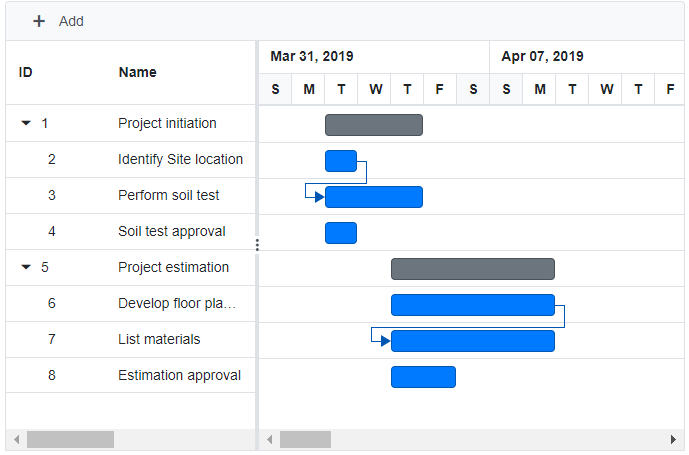

# Enable/disable predecessor validation

## EnablePredecessorValidation

By default, Gantt tasks date values are validated based on predecessor values. You can disable/enable this validation by using the [EnablePredecessorValidation](https://help.syncfusion.com/cr/blazor/Syncfusion.Blazor.Gantt.SfGantt-1.html#Syncfusion_Blazor_Gantt_SfGantt_1_EnablePredecessorValidation) property. By default, `EnablePredecessorValidation` is true. The following code example shows how to disable predecessor validation in Gantt.

```cshtml
@using Syncfusion.Blazor.Gantt

<SfGantt @ref="Gantt" DataSource="@TaskCollection" Height="450px" Width="1000px" ProjectStartDate="ProjectStart" ProjectEndDate="ProjectEnd"
 Toolbar="@(new List<string>() { "Add", "Edit", "Update", "Cancel"})" EnablePredecessorValidation="false">
    <GanttTaskFields Id="TaskId" Name="TaskName" StartDate="StartDate"
                     Duration="Duration" Dependency="Predecessor" ParentID="ParentId"></GanttTaskFields>
    <GanttEditSettings AllowTaskbarEditing="true" AllowEditing="true" AllowAdding="true"></GanttEditSettings>
</SfGantt>

@code {
    public SfGantt<TaskData> Gantt;
    public DateTime ProjectStart = new DateTime(2019, 3, 31);
    public DateTime ProjectEnd = new DateTime(2019, 07, 06);
    public List<TaskData> TaskCollection { get; set; }

    protected override void OnInitialized()
    {
        this.TaskCollection = GetTaskCollection();
    }

    public class TaskData
    {
        public int TaskId { get; set; }
        public string TaskName { get; set; }
        public DateTime StartDate { get; set; }
        public string Duration { get; set; }
        public string Predecessor { get; set; }
        public int Progress { get; set; }
        public int? ParentId { get; set; }
    }

    public static List<TaskData> GetTaskCollection()
    {
        List<TaskData> Tasks = new List<TaskData>() {
            new TaskData() { TaskId = 1, TaskName = "Project initiation", StartDate = new DateTime(2019, 04, 02)},
            new TaskData() { TaskId = 2, TaskName = "Identify Site location", StartDate = new DateTime(2019, 04, 02), Progress = 30, ParentId = 1},
            new TaskData() { TaskId = 3, TaskName = "Perform soil test", StartDate = new DateTime(2019, 04, 02), Duration = "3", Progress = 40, Predecessor = "2fs", ParentId = 1 },
            new TaskData() { TaskId = 4, TaskName = "Soil test approval", StartDate = new DateTime(2019, 04, 02), Duration = "1", Progress = 30, ParentId = 1 },
            new TaskData() { TaskId = 5, TaskName = "Project estimation", StartDate = new DateTime(2019, 04, 02) },
            new TaskData() { TaskId = 6, TaskName = "Develop floor plan for estimation", StartDate = new DateTime(2019, 04, 04), Duration = "3", Progress = 30, ParentId = 5 },
            new TaskData() { TaskId = 7, TaskName = "List materials", StartDate = new DateTime(2019, 04, 04), Duration = "3", Progress = 40, Predecessor = "6", ParentId = 5 },
            new TaskData() { TaskId = 8, TaskName = "Estimation approval", StartDate = new DateTime(2019, 04, 04), Duration = "2", Progress = 30, ParentId = 5 }
        };
        return Tasks;
    }
}
```


## EnableAutoLinkValidation

When the connector lines are drawn between tasks, the task date gets validated based on predecessor values. You can restrict this validation on predecessor drawing using the [OnActionBegin](https://help.syncfusion.com/cr/blazor/Syncfusion.Blazor.Gantt.GanttEvents-1.html#Syncfusion_Blazor_Gantt_GanttEvents_1_OnActionBegin) event which gets triggered with the [Action](https://help.syncfusion.com/cr/blazor/Syncfusion.Blazor.Gantt.GanttActionEventArgs-1.html#Syncfusion_Blazor_Gantt_GanttActionEventArgs_1_Action) argument as `DrawConnectorLine`. You can enable/disable the validation using [EnableAutoLinkValidation](https://help.syncfusion.com/cr/blazor/Syncfusion.Blazor.Gantt.GanttActionEventArgs-1.html#Syncfusion_Blazor_Gantt_GanttActionEventArgs_1_EnableAutoLinkValidation) event argument. By default, `EnableAutoLinkValidation` is true.

```cshtml
@using Syncfusion.Blazor.Gantt

<SfGantt @ref="Gantt" DataSource="@TaskCollection" Height="450px" Width="1000px" Toolbar="@(new List<string>() { "Add", "Edit", "Update", "Cancel"})">
    <GanttTaskFields Id="TaskId" Name="TaskName" StartDate="StartDate"
                     Duration="Duration" Dependency="Predecessor" ParentID="ParentId"></GanttTaskFields>
    <GanttEditSettings AllowTaskbarEditing="true" AllowEditing="true" AllowAdding="true"></GanttEditSettings>
    <GanttEvents OnActionBegin="ActionBegin" TValue="TaskData"></GanttEvents>
</SfGantt>

@code {
    public SfGantt<TaskData> Gantt;
    public DateTime ProjectStart = new DateTime(2019, 3, 24);
    public DateTime ProjectEnd = new DateTime(2019, 7, 6);
    public List<TaskData> TaskCollection { get; set; }

    protected override void OnInitialized()
    {
        this.TaskCollection = GetTaskCollection();
    }

    public void ActionBegin(GanttActionEventArgs<TaskData> args)
    {
        if (args.Action != null && args.Action.Equals("DrawConnectorLine", StringComparison.Ordinal))
        {
            args.EnableAutoLinkValidation = false;
        }
    }

    public class TaskData
    {
        public int TaskId { get; set; }
        public string TaskName { get; set; }
        public DateTime StartDate { get; set; }
        public string Duration { get; set; }
        public string Predecessor { get; set; }
        public int Progress { get; set; }
        public int? ParentId { get; set; }
    }

    public static List<TaskData> GetTaskCollection()
    {
        List<TaskData> Tasks = new List<TaskData>() {
            new TaskData() { TaskId = 1, TaskName = "Project initiation", StartDate = new DateTime(2019, 04, 02)},
            new TaskData() { TaskId = 2, TaskName = "Identify Site location", StartDate = new DateTime(2019, 04, 02), Progress = 30, ParentId = 1},
            new TaskData() { TaskId = 3, TaskName = "Perform soil test", StartDate = new DateTime(2019, 04, 02), Duration = "3", Progress = 40, Predecessor = "2fs", ParentId = 1 },
            new TaskData() { TaskId = 4, TaskName = "Soil test approval", StartDate = new DateTime(2019, 04, 02), Duration = "1", Progress = 30, ParentId = 1 },
            new TaskData() { TaskId = 5, TaskName = "Project estimation", StartDate = new DateTime(2019, 04, 02) },
            new TaskData() { TaskId = 6, TaskName = "Develop floor plan for estimation", StartDate = new DateTime(2019, 04, 04), Duration = "3", Progress = 30, ParentId = 5 },
            new TaskData() { TaskId = 7, TaskName = "List materials", StartDate = new DateTime(2019, 04, 04), Duration = "3", Progress = 40, ParentId = 5 },
            new TaskData() { TaskId = 8, TaskName = "Estimation approval", StartDate = new DateTime(2019, 04, 04), Duration = "2", Progress = 30, ParentId = 5 }
        };
        return Tasks;
    }
}
```


> EnablePredecessorValidation is used to enable/disable validation based on predecessor values both on load time and on edit actions like cell editing, dialog editing, and on predecessor drawing. Whereas, [EnableAutoLinkValidation](https://help.syncfusion.com/cr/blazor/Syncfusion.Blazor.Gantt.GanttActionEventArgs-1.html#Syncfusion_Blazor_Gantt_GanttActionEventArgs_1_EnableAutoLinkValidation) event argument is used to enable/disable validation only on predecessor drawing. 