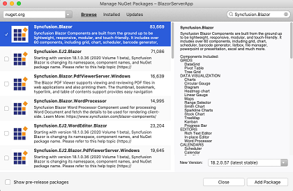

<!-- markdownlint-disable MD024 -->

# Getting started with Blazor Server Side App in VS for Mac

This article provides a step-by-step introduction to configure Syncfusion Blazor setup, and also to build and run a simple Blazor Server Side application using [Visual Studio for Mac](https://visualstudio.microsoft.com/vs/mac/).

> Starting with version 17.4.0.39 (2019 Volume 4), you need to include a valid license key (either paid or trial key) within your applications. Please refer to this [help topic](https://help.syncfusion.com/common/essential-studio/licensing/license-key#blazor) for more information.

## Prerequisites

* [Visual Studio for Mac](https://visualstudio.microsoft.com/vs/mac/)
* [.NET Core SDK 3.1.8](https://dotnet.microsoft.com/download/dotnet/3.1) / [.NET 5.0 SDK](https://dotnet.microsoft.com/download/dotnet/5.0)

> **.NET Core SDK 3.1.8** requires Visual Studio for Mac 8.7.6 or later. <br /> **.NET 5.0** requires Visual Studio 2019 for Mac 8.8 or later.

## Create a Blazor Server side project in Visual Studio for Mac

1. Choose **New** from the Visual Studio for Mac dashboard.

    

2. Select **Blazor Server App** from the template, and then click the **Next** button.

    

3. Continue with the **No Authentication** selection in Authentication, and then click the **Next** button.

    

4. Now, the Blazor Server App project configuration window will popup. Click the **Create** button to create a new project after filling in the Project name.

    

## Installing Syncfusion Blazor packages in the application

You can use any one of the below standards to install the Syncfusion Blazor library in your application.

### Using Syncfusion Blazor individual NuGet Packages [New standard]

> Starting with Volume 4, 2020 (v18.4.0.30) release, Syncfusion provides [individual NuGet packages](https://blazor.syncfusion.com/documentation/nuget-packages/) for our Syncfusion Blazor components. We highly recommend this new standard for your Blazor production applications. Refer to [this section](https://blazor.syncfusion.com/documentation/nuget-packages/#benefits-of-using-individual-nuget-packages) to know the benefits of the individual NuGet packages.

1. Now, install **Syncfusion.Blazor.Calendars** NuGet package to the new application using the `NuGet Package Manager`. Refer to the [Individual NuGet Packages](https://blazor.syncfusion.com/documentation/nuget-packages/) section for the available NuGet packages.

    

2. Search **Syncfusion.Blazor.Calendars** keyword in the Browse tab and install **Syncfusion.Blazor.Calendars** NuGet package in the application.

3. Once the installation process is completed, the Syncfusion Blazor Calendars package will be installed in the project.

4. Add the Syncfusion bootstrap4 theme in the `<head>` element of the **~/Pages/_Host.cshtml** page.

    ```html
    <head>
        ....
        ....
        <link href="_content/Syncfusion.Blazor.Themes/bootstrap4.css" rel="stylesheet" />
    </head>
    ```

    W> `Syncfusion.Blazor` package should not be installed along with [individual NuGet packages](https://blazor.syncfusion.com/documentation/nuget-packages/). Hence, you have to add the above `Syncfusion.Blazor.Themes` static web assets (styles) in the application.

### Using Syncfusion.Blazor NuGet Package [Old standard]

W> If you prefer the above new standard (individual NuGet packages), then skip this section. Using both old and new standards in the same application will throw ambiguous compilation errors.

1. Now, install **Syncfusion.Blazor** NuGet package to the newly created application by using the `NuGet Package Manager`. Right-click the project, and then select Manage NuGet Packages.

    

2. Search **Syncfusion.Blazor** keyword in the Browse tab and install **Syncfusion.Blazor** NuGet package in the application.

    

3. The Syncfusion Blazor package will be installed in the project once the installation process is completed.

4. Add the Syncfusion bootstrap4 theme in the `<head>` element of the **~/Pages/_Host.html** page.

    ```html
    <head>
        ....
        ....
        <link href="_content/Syncfusion.Blazor.Themes/bootstrap4.css" rel="stylesheet" />
    </head>
    ```

    > The same theme file can be referred through the CDN version by using [https://cdn.syncfusion.com/blazor/{{ site.blazorversion }}/styles/bootstrap4.css](https://cdn.syncfusion.com/blazor/19.4.38/styles/bootstrap4.css).

## Adding Syncfusion Blazor component and running the application

1. Open **~/_Imports.razor** file and import the `Syncfusion.Blazor`.

    ```cshtml
    @using Syncfusion.Blazor
    @using Syncfusion.Blazor.Calendars
    ```

2. Open the **~/Startup.cs** file and register the Syncfusion Blazor Service.

    ```c#
    using Syncfusion.Blazor;

    namespace WebApplication1
    {
        public class Startup
        {
            public void ConfigureServices(IServiceCollection services)
            {
                ....
                ....
                services.AddSyncfusionBlazor();
            }
        }
    }
    ```

    > We can disable the dynamic script loading and refer to the scripts from the application end by using the `IgnoreScriptIsolation` parameter in `AddSyncfusionBlazor()` at the `program.cs`. For more details, please refer here for [how to refer custom/CDN resources](../common/custom-resource-generator/#how-to-use-custom-resources-in-the-blazor-application).

3. Now, add the Syncfusion Blazor components in any .razor file in the `~/Pages` folder. For example, the Calendar component is added in the **~/Pages/Index.razor** page.

    ```cshtml
    <SfCalendar TValue="DateTime"></SfCalendar>
    ```

4. Run the application, the Syncfusion Blazor Calendar component will be rendered in the default web browser.

    
