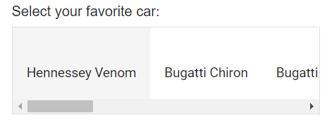

# Styles and Appearances in Blazor ListBox Component

To modify the ListBox appearance, you need to override the default CSS of ListBox component. Please find the list of CSS classes and its corresponding section in ListBox component. Also, you have an option to create your own custom theme for the controls using our [Theme Studio](https://blazor.syncfusion.com/themestudio/?theme=material).

| CSS Class | Purpose of Class |
| ----- | ----- |
|.e-listbox-container | To customize the listbox container |
|.e-listbox-container .e-list-item | To customize the listbox list items |
|.e-listbox-container .e-list-item:hover:not(.e-selected):not(.e-disabled) | To customize the listbox list items on hover |
|.e-listbox-container .e-list-item.e-selected | To customize the listbox selected list item |
|.e-listboxtool-container .e-listbox-tool | To customize the listbox toolbar |
|.e-listboxtool-container .e-listbox-tool .e-btn | To customize the listbox toolbar button |
|.e-listboxtool-container .e-listbox-tool .e-btn .e-btn-icon.e-icons::before | To customize the listbox toolbar icon |

## Horizontal ListBox

You can use [CssClass](https://help.syncfusion.com/cr/blazor/Syncfusion.Blazor.DropDowns.SfListBox-2.html#Syncfusion_Blazor_DropDowns_SfListBox_2_CssClass) property to display the Listbox horizontally.




    <h6>Select your favorite car:</h6>
    <SfListBox Value=@Value CssClass="e-horizontal-listbox" DataSource="@Data" TValue="string[]" TItem="DataValues"></SfListBox>

@code{
    public string[] Value = new string[] { "Hennessey Venom" };
    public List<DataValues> Data = new List<DataValues> {
        new DataValues{ text = "Hennessey Venom", id = "list-01" },
        new DataValues{ text = "Bugatti Chiron", id = "list-02" },
        new DataValues{ text = "Bugatti Veyron Super Sport", id = "list-03" },
        new DataValues{ text = "SSC Ultimate Aero", id = "list-04" },
        new DataValues{ text = "Koenigsegg CCR", id = "list-05" },
        new DataValues{ text = "McLaren F1", id = "list-06" },
        new DataValues{ text = "Aston Martin One- 77", id = "list-07" },
        new DataValues{ text = "Jaguar XJ220", id = "list-08" },
        new DataValues{ text = "McLaren P1", id = "list-09" },
        new DataValues{ text = "Ferrari LaFerrari", id = "list-10" }
    };
    public class DataValues
    {
        public string text { get; set; }
        public string id { get; set; }
    }
}




[View Sample in GitHub](https://github.com/SyncfusionExamples/how-to-set-the-blazor-list-box-items-as-horizontal-list)