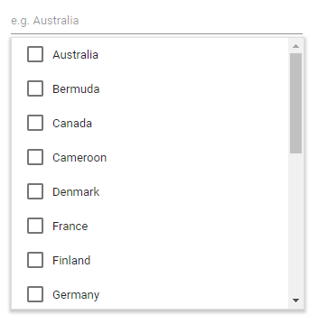
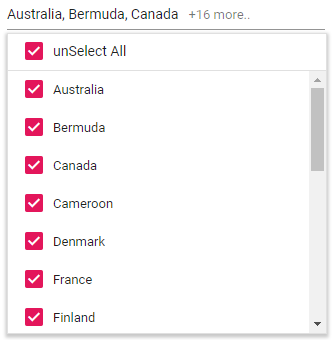
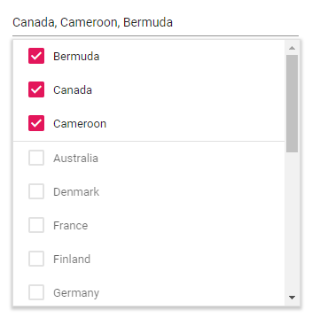
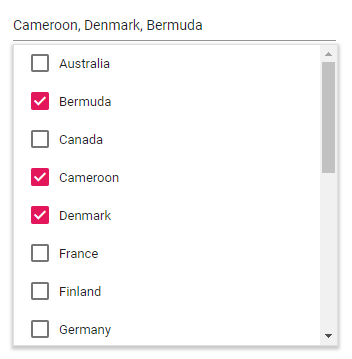

# CheckBox in Blazor MultiSelect Dropdown Component

The MultiSelect has built-in support to select multiple values through checkbox, when the [Mode](https://help.syncfusion.com/cr/blazor/Syncfusion.Blazor.DropDowns.SfMultiSelect-1.html#Syncfusion_Blazor_DropDowns_SfMultiSelect_1_Mode) property is set to `CheckBox`.

To use checkbox, inject the `CheckBoxSelection` module in the MultiSelect.

```cshtml
@using Syncfusion.Blazor.DropDowns

<SfMultiSelect TValue="string[]" Placeholder="e.g. Australia" Mode="VisualMode.CheckBox" DataSource="@Country">
    <MultiSelectFieldSettings Value="Code" Text="Name"></MultiSelectFieldSettings>
</SfMultiSelect>

@code {

    public class Countries
    {
        public string Name { get; set; }

        public string Code { get; set; }
    }

    List<Countries>Country = new List<Countries>
    {
        new Countries() { Name = "Australia", Code = "AU" },
        new Countries() { Name = "Bermuda", Code = "BM" },
        new Countries() { Name = "Canada", Code = "CA" },
        new Countries() { Name = "Cameroon", Code = "CM" },
        new Countries() { Name = "Denmark", Code = "DK" },
        new Countries() { Name = "France", Code = "FR" },
        new Countries() { Name = "Finland", Code = "FI" },
        new Countries() { Name = "Germany", Code = "DE" },
        new Countries() { Name = "Greenland", Code = "GL" },
        new Countries() { Name = "Hong Kong", Code = "HK" },
        new Countries() { Name = "India", Code = "IN" },
        new Countries() { Name = "Italy", Code = "IT" },
        new Countries() { Name = "Japan", Code = "JP" },
        new Countries() { Name = "Mexico", Code = "MX" },
        new Countries() { Name = "Norway", Code = "NO" },
        new Countries() { Name = "Poland", Code = "PL" },
        new Countries() { Name = "Switzerland", Code = "CH" },
        new Countries() { Name = "United Kingdom", Code = "GB" },
        new Countries() { Name = "United States", Code = "US" },
    };
}
```



## Select All

The MultiSelect component has in-built support to select all the list items using `Select All` options in the header. When the [ShowSelectAll](https://help.syncfusion.com/cr/blazor/Syncfusion.Blazor.DropDowns.SfMultiSelect-1.html#Syncfusion_Blazor_DropDowns_SfMultiSelect_1_ShowSelectAll) property is set to true, by default Select All text will show. You can customize the name attribute of the Select All option by using [SelectAllText](https://help.syncfusion.com/cr/blazor/Syncfusion.Blazor.DropDowns.SfMultiSelect-1.html#Syncfusion_Blazor_DropDowns_SfMultiSelect_1_SelectAllText).

For the unSelect All option, by default unSelect All text will show. You can customize the name attribute of the unSelect All option by using [UnSelectAllText](https://help.syncfusion.com/cr/blazor/Syncfusion.Blazor.DropDowns.SfMultiSelect-1.html#Syncfusion_Blazor_DropDowns_SfMultiSelect_1_UnSelectAllText).

```cshtml
@using Syncfusion.Blazor.DropDowns

<SfMultiSelect TValue="string[]" Placeholder="e.g. Australia" ShowSelectAll=true SelectAllText="Select All" UnSelectAllText="unSelect All" Mode="VisualMode.CheckBox" DataSource="@Country">
    <MultiSelectFieldSettings Text="Name" Value="Code"></MultiSelectFieldSettings>
</SfMultiSelect>

@code {

    public class Countries
    {
        public string Name { get; set; }

        public string Code { get; set; }
    }

    List<Countries>Country = new List<Countries>
    {
        new Countries() { Name = "Australia", Code = "AU" },
        new Countries() { Name = "Bermuda", Code = "BM" },
        new Countries() { Name = "Canada", Code = "CA" },
        new Countries() { Name = "Cameroon", Code = "CM" },
        new Countries() { Name = "Denmark", Code = "DK" },
        new Countries() { Name = "France", Code = "FR" },
        new Countries() { Name = "Finland", Code = "FI" },
        new Countries() { Name = "Germany", Code = "DE" },
        new Countries() { Name = "Greenland", Code = "GL" },
        new Countries() { Name = "Hong Kong", Code = "HK" },
        new Countries() { Name = "India", Code = "IN" },
        new Countries() { Name = "Italy", Code = "IT" },
        new Countries() { Name = "Japan", Code = "JP" },
        new Countries() { Name = "Mexico", Code = "MX" },
        new Countries() { Name = "Norway", Code = "NO" },
        new Countries() { Name = "Poland", Code = "PL" },
        new Countries() { Name = "Switzerland", Code = "CH" },
        new Countries() { Name = "United Kingdom", Code = "GB" },
        new Countries() { Name = "United States", Code = "US" },
    };
}
```



## Selection Limit

Defines the limit of the selected items using [MaximumSelectionLength](https://help.syncfusion.com/cr/blazor/Syncfusion.Blazor.DropDowns.SfMultiSelect-1.html#Syncfusion_Blazor_DropDowns_SfMultiSelect_1_MaximumSelectionLength).

```cshtml
<SfMultiSelect TValue="string[]" Placeholder="e.g. Australia" MaximumSelectionLength=3 Mode="VisualMode.CheckBox" DataSource="@Country">
    <MultiSelectFieldSettings Text="Name" Value="Code"></MultiSelectFieldSettings>
</SfMultiSelect>

@code {

    public class Countries
    {
        public string Name { get; set; }

        public string Code { get; set; }
    }

    List<Countries>Country = new List<Countries>
    {
        new Countries() { Name = "Australia", Code = "AU" },
        new Countries() { Name = "Bermuda", Code = "BM" },
        new Countries() { Name = "Canada", Code = "CA" },
        new Countries() { Name = "Cameroon", Code = "CM" },
        new Countries() { Name = "Denmark", Code = "DK" },
        new Countries() { Name = "France", Code = "FR" },
        new Countries() { Name = "Finland", Code = "FI" },
        new Countries() { Name = "Germany", Code = "DE" },
        new Countries() { Name = "Greenland", Code = "GL" },
        new Countries() { Name = "Hong Kong", Code = "HK" },
        new Countries() { Name = "India", Code = "IN" },
        new Countries() { Name = "Italy", Code = "IT" },
        new Countries() { Name = "Japan", Code = "JP" },
        new Countries() { Name = "Mexico", Code = "MX" },
        new Countries() { Name = "Norway", Code = "NO" },
        new Countries() { Name = "Poland", Code = "PL" },
        new Countries() { Name = "Switzerland", Code = "CH" },
        new Countries() { Name = "United Kingdom", Code = "GB" },
        new Countries() { Name = "United States", Code = "US" },
    };
}
```



## Selection Reordering

Using [EnableSelectionOrder](https://help.syncfusion.com/cr/blazor/Syncfusion.Blazor.DropDowns.SfMultiSelect-1.html#Syncfusion_Blazor_DropDowns_SfMultiSelect_1_EnableSelectionOrder) to Reorder the selected items in popup visibility state.

```cshtml
<SfMultiSelect TValue="string[]" Placeholder="e.g. Australia" EnableSelectionOrder=false  Mode="VisualMode.CheckBox" DataSource="@Country">
    <MultiSelectFieldSettings Text="Name" Value="Code"></MultiSelectFieldSettings>
</SfMultiSelect>

@code {

    public class Countries
    {
        public string Name { get; set; }

        public string Code { get; set; }
    }

    List<Countries>Country = new List<Countries>
    {
        new Countries() { Name = "Australia", Code = "AU" },
        new Countries() { Name = "Bermuda", Code = "BM" },
        new Countries() { Name = "Canada", Code = "CA" },
        new Countries() { Name = "Cameroon", Code = "CM" },
        new Countries() { Name = "Denmark", Code = "DK" },
        new Countries() { Name = "France", Code = "FR" },
        new Countries() { Name = "Finland", Code = "FI" },
        new Countries() { Name = "Germany", Code = "DE" },
        new Countries() { Name = "Greenland", Code = "GL" },
        new Countries() { Name = "Hong Kong", Code = "HK" },
        new Countries() { Name = "India", Code = "IN" },
        new Countries() { Name = "Italy", Code = "IT" },
        new Countries() { Name = "Japan", Code = "JP" },
        new Countries() { Name = "Mexico", Code = "MX" },
        new Countries() { Name = "Norway", Code = "NO" },
        new Countries() { Name = "Poland", Code = "PL" },
        new Countries() { Name = "Switzerland", Code = "CH" },
        new Countries() { Name = "United Kingdom", Code = "GB" },
        new Countries() { Name = "United States", Code = "US" },
    };
}
```



## See Also

* [Blazor MultiSelect DropDown with selection stacked vertically in CheckBox](https://www.syncfusion.com/forums/172062/how-to-stack-selected-items-vertically-in-a-multiselct-dropdown)
* [Disable CheckBox for certain values in Blazor MultiSelect DropDown](https://www.syncfusion.com/forums/157795/is-it-possible-to-disable-checkbox-for-certain-values-in-multiselect-dropdown)