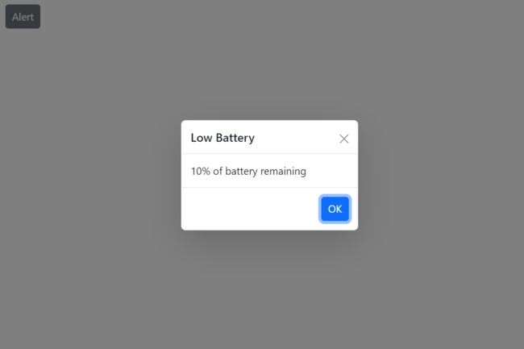
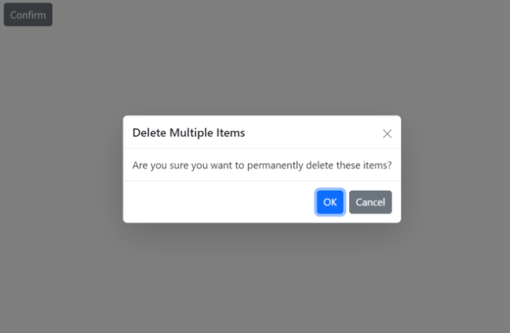
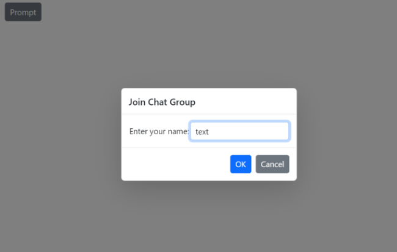

# Customization of Predefined Dialogs in Blazor

## Customize action buttons

You can customize the predefined dialogs buttons by using below properties.
* [DialogOptions.PrimaryButtonOptions](https://help.syncfusion.com/cr/blazor/Syncfusion.Blazor.Popups.DialogOptions.html#Syncfusion_Blazor_Popups_DialogOptions_PrimaryButtonOptions) - Use this property to customize **OK** button text and appearence.
* [DialogOptions.CancelButtonOptions](https://help.syncfusion.com/cr/blazor/Syncfusion.Blazor.Popups.DialogOptions.html#Syncfusion_Blazor_Popups_DialogOptions_CancelButtonOptions) - Use this property to customize **Cancel** button text and appearence.

Use the following code to customize the predefined dialog action buttons.

For alert dialog , customized the default dialog button content as `Okay` by using the [DialogButtonOptions.Content](https://help.syncfusion.com/cr/blazor/Syncfusion.Blazor.Popups.DialogButtonOptions.html#Syncfusion_Blazor_Popups_DialogButtonOptions_Content) property.

For confirm dialog, customized the default dialog buttons content as `Yes` and `No` by using the `DialogButtonOptions.Content` property and also customized the dialog button icons by using[DialogButtonOptions.IconCss](https://help.syncfusion.com/cr/blazor/Syncfusion.Blazor.Popups.DialogButtonOptions.html#Syncfusion_Blazor_Popups_DialogButtonOptions_IconCss) property.

For prompt dialog , customized the default dialog buttons content as `Connect` and `Close` by using [DialogButtonOptions.Content](https://help.syncfusion.com/cr/blazor/Syncfusion.Blazor.Popups.DialogButtonOptions.html#Syncfusion_Blazor_Popups_DialogButtonOptions_Content) property.

















## Show or hide dialog close button 

You can show or hide close button in dialog using the [DialogOptions.ShowCloseIcon](https://help.syncfusion.com/cr/blazor/Syncfusion.Blazor.Popups.DialogOptions.html#Syncfusion_Blazor_Popups_DialogOptions_ShowCloseIcon) property.The default value is `true`.

















## Customize dialog content

You can load custom content in predefined dialogs using the [DialogOptions.ChildContent](https://help.syncfusion.com/cr/blazor/Syncfusion.Blazor.Popups.DialogOptions.html#Syncfusion_Blazor_Popups_DialogOptions_ChildContent) property. 

Use the following code to customize the dialog content to render the custom TextBox inside the propmt dialog to get the username from the user.









