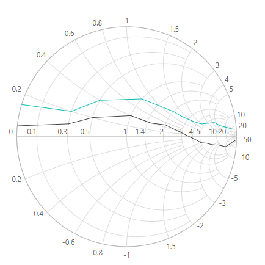
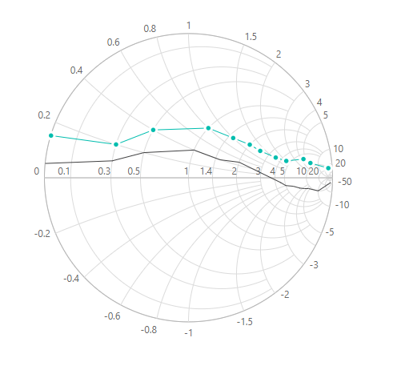
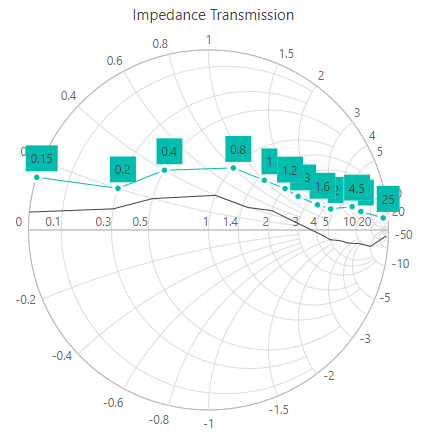
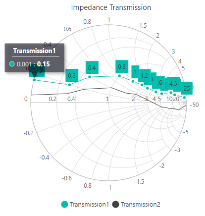

# Getting Started with Blazor Smith Chart Component

This section briefly explains about how to include [Blazor Smith Chart](https://www.syncfusion.com/blazor-components/blazor-smith-chart) component in your Blazor Server App and Blazor WebAssembly App using Visual Studio.

## Prerequisites

* [System requirements for Blazor components](https://blazor.syncfusion.com/documentation/system-requirements)

## Create a new Blazor App in Visual Studio

You can create **Blazor Server App** or **Blazor WebAssembly App** using Visual Studio in one of the following ways,

* [Create a Project using Microsoft Templates](https://docs.microsoft.com/en-us/aspnet/core/blazor/tooling?pivots=windows)

* [Create a Project using Syncfusion Blazor Extension](https://blazor.syncfusion.com/documentation/visual-studio-integration/vs2019-extensions/create-project)

## Install Syncfusion Blazor SmithChart NuGet in the App

Syncfusion Blazor components are available in [nuget.org](https://www.nuget.org/packages?q=syncfusion.blazor). To use Syncfusion Blazor components in the application, add reference to the corresponding NuGet. Refer to [NuGet packages topic](https://blazor.syncfusion.com/documentation/nuget-packages) for available NuGet packages list with component details.

To add Blazor Smith Chart component in the app, open the NuGet package manager in Visual Studio (*Tools → NuGet Package Manager → Manage NuGet Packages for Solution*), search for [Syncfusion.Blazor.SmithChart](https://www.nuget.org/packages/Syncfusion.Blazor.SmithChart) and then install it.

## Register Syncfusion Blazor Service

Open **~/_Imports.razor** file and import the Syncfusion.Blazor namespace.




@using Syncfusion.Blazor




Now, register the Syncfusion Blazor Service in the Blazor Server App or Blazor WebAssembly App. Here, Syncfusion Blazor Service is registered by setting [IgnoreScriptIsolation](https://help.syncfusion.com/cr/blazor/Syncfusion.Blazor.GlobalOptions.html#Syncfusion_Blazor_GlobalOptions_IgnoreScriptIsolation) property as true to load the scripts externally in the [next steps](#add-script-reference).

### Blazor Server App

* For **.NET 6** app, open the **~/Program.cs** file and register the Syncfusion Blazor Service.

* For **.NET 5 and .NET 3.X** app, open the **~/Startup.cs** file and register the Syncfusion Blazor Service.




using Microsoft.AspNetCore.Components;
using Microsoft.AspNetCore.Components.Web;
using Syncfusion.Blazor;

var builder = WebApplication.CreateBuilder(args);

// Add services to the container.
builder.Services.AddRazorPages();
builder.Services.AddServerSideBlazor();
builder.Services.AddSyncfusionBlazor(options => { options.IgnoreScriptIsolation = true; });

var app = builder.Build();
....





using Syncfusion.Blazor;

namespace BlazorApplication
{
    public class Startup
    {
        ...
        public void ConfigureServices(IServiceCollection services)
        {
            services.AddRazorPages();
            services.AddServerSideBlazor();
            services.AddSyncfusionBlazor(options => { options.IgnoreScriptIsolation = true; });
        }
        ...
    }
}




### Blazor WebAssembly App

Open **~/Program.cs** file and register the Syncfusion Blazor Service in the client web app.




using Microsoft.AspNetCore.Components.Web;
using Microsoft.AspNetCore.Components.WebAssembly.Hosting;
using Syncfusion.Blazor;

var builder = WebAssemblyHostBuilder.CreateDefault(args);
builder.RootComponents.Add<App>("#app");
builder.RootComponents.Add<HeadOutlet>("head::after");

builder.Services.AddScoped(sp => new HttpClient { BaseAddress = new Uri(builder.HostEnvironment.BaseAddress) });

builder.Services.AddSyncfusionBlazor(options => { options.IgnoreScriptIsolation = true; });
await builder.Build().RunAsync();
....





using Syncfusion.Blazor;

namespace WebApplication1
{
    public class Program
    {
        public static async Task Main(string[] args)
        {
            ....
            builder.Services.AddSyncfusionBlazor(options => { options.IgnoreScriptIsolation = true; });
            await builder.Build().RunAsync();
        }
    }
}




## Add Style Sheet

Checkout the [Blazor Themes topic](https://blazor.syncfusion.com/documentation/appearance/themes) to learn different ways ([Static Web Assets](https://blazor.syncfusion.com/documentation/appearance/themes#static-web-assets), [CDN](https://blazor.syncfusion.com/documentation/appearance/themes#cdn-reference) and [CRG](https://blazor.syncfusion.com/documentation/common/custom-resource-generator)) to refer themes in Blazor application, and to have the expected appearance for Syncfusion Blazor components. Here, the theme is referred using [Static Web Assets](https://blazor.syncfusion.com/documentation/appearance/themes#static-web-assets).

To add theme to the app, open the NuGet package manager in Visual Studio (*Tools → NuGet Package Manager → Manage NuGet Packages for Solution*), search for [Syncfusion.Blazor.Themes](https://www.nuget.org/packages/Syncfusion.Blazor.Themes/) and then install it. Then, the theme style sheet from NuGet can be referred as follows,

### Blazor Server App

* For .NET 6 app, add the Syncfusion bootstrap5 theme in the `<head>` of the **~/Pages/_Layout.cshtml** file.

* For .NET 5 and .NET 3.X app, add the Syncfusion bootstrap5 theme in the `<head>` of the **~/Pages/_Host.cshtml** file.




<head>
    <link href="_content/Syncfusion.Blazor.Themes/bootstrap5.css" rel="stylesheet" />
</head>





<head>
    <link href="_content/Syncfusion.Blazor.Themes/bootstrap5.css" rel="stylesheet" />
</head>




### Blazor WebAssembly App

For Blazor WebAssembly App, Refer the theme style sheet from NuGet in the `<head>` of **wwwroot/index.html** file in the client web app.




<head>
    <link href="_content/Syncfusion.Blazor.Themes/bootstrap5.css" rel="stylesheet" />
</head>




## Add Script Reference

Checkout [Adding Script Reference topic](https://blazor.syncfusion.com/documentation/common/adding-script-references) to learn different ways to add script reference in Blazor Application. In this getting started walk-through, the required scripts are referred using [Static Web Assets](https://blazor.syncfusion.com/documentation/common/adding-script-references#static-web-assets) externally inside the `<head>` as follows,

### Blazor Server App

* For **.NET 6** app, Refer script in the `<head>` of the **~/Pages/_Layout.cshtml** file.

* For **.NET 5 and .NET 3.X** app, Refer script in the `<head>` of the **~/Pages/_Host.cshtml** file.




<head>
    ....
    <link href="_content/Syncfusion.Blazor.Themes/bootstrap5.css" rel="stylesheet" />
    
</head>





<head>
    ....
    <link href="_content/Syncfusion.Blazor.Themes/bootstrap5.css" rel="stylesheet" />
    
</head>




### Blazor WebAssembly App

For Blazor WebAssembly App, Refer script in the `<head>` of the **~/index.html** file.




<head>
    ....
    <link href="_content/Syncfusion.Blazor.Themes/bootstrap5.css" rel="stylesheet" />
    
</head>




> Syncfusion recommends to reference scripts using [Static Web Assets](https://blazor.syncfusion.com/documentation/common/adding-script-references#static-web-assets), [CDN](https://blazor.syncfusion.com/documentation/common/adding-script-references#cdn-reference) and [CRG](https://blazor.syncfusion.com/documentation/common/custom-resource-generator) by [disabling JavaScript isolation](https://blazor.syncfusion.com/documentation/common/adding-script-references#disable-javascript-isolation) for better loading performance of the Blazor application.

## Add Blazor Smith Chart component

* Open **~/_Imports.razor** file or any other page under the `~/Pages` folder where the component is to be added and import the **Syncfusion.Blazor.Charts** namespace.




@using Syncfusion.Blazor
@using Syncfusion.Blazor.Charts




* Now, add the Syncfusion Smith Chart component in razor file. Here, the Smith Chart component is added in the **~/Pages/Index.razor** file under the **~/Pages** folder.




<SfSmithchart>

</SfSmithchart>




* Press <kbd>Ctrl</kbd>+<kbd>F5</kbd> (Windows) or <kbd>⌘</kbd>+<kbd>F5</kbd> (macOS) to run the application. Then, the Syncfusion `Blazor Smith Chart` component will be rendered in the default web browser.

## Adding series to Smith Chart

`Smith Chart` series can be added in two ways. Use either [Points](https://help.syncfusion.com/cr/blazor/Syncfusion.Blazor.Charts.SmithChartSeries.html#Syncfusion_Blazor_Charts_SmithChartSeries_Points) or [Datasource](https://help.syncfusion.com/cr/blazor/Syncfusion.Blazor.Charts.SmithChartSeries.html#Syncfusion_Blazor_Charts_SmithChartSeries_DataSource) in the [SmithChartSeries](https://help.syncfusion.com/cr/blazor/Syncfusion.Blazor.Charts.SmithChartSeries.html).

If you add using [Datasource](https://help.syncfusion.com/cr/blazor/Syncfusion.Blazor.Charts.SmithChartSeries.html#Syncfusion_Blazor_Charts_SmithChartSeries_DataSource) property, additionally you need to specify data source mapping fields using [Reactance](https://help.syncfusion.com/cr/blazor/Syncfusion.Blazor.Charts.SmithChartSeries.html#Syncfusion_Blazor_Charts_SmithChartSeries_Reactance) and [Resistance](https://help.syncfusion.com/cr/blazor/Syncfusion.Blazor.Charts.SmithChartSeries.html#Syncfusion_Blazor_Charts_SmithChartSeries_Resistance) properties.

If you are using [Points](https://help.syncfusion.com/cr/blazor/Syncfusion.Blazor.Charts.SmithChartSeries.html#Syncfusion_Blazor_Charts_SmithChartSeries_Points), you don't need to specify mapping fields as like in [DataSource](https://help.syncfusion.com/cr/blazor/Syncfusion.Blazor.Charts.SmithChartSeries.html#Syncfusion_Blazor_Charts_SmithChartSeries_DataSource). But the [Points](https://help.syncfusion.com/cr/blazor/Syncfusion.Blazor.Charts.SmithChartSeries.html#Syncfusion_Blazor_Charts_SmithChartSeries_Points) collection should be `SmithChartPoint` type and define `Resistance` and `Reactance` properties mandatorily.

The following sample demonstrates adding two series to Smith Chart in both ways.

* First series `Transmission1` shows `DataSource` bound series.
* Second series `Transmission2` shows `Points` bound series.




<SfSmithChart>
    <SmithChartSeriesCollection>
        <SmithChartSeries Name="Transmission1"
                          Reactance="Reactance"
                          Resistance="Resistance"
                          DataSource="@FirstTransmissionSeries">
        </SmithChartSeries>
        <SmithChartSeries Name="Transmission2"
                          Points="@SecondTransmissionSeries">
        </SmithChartSeries>
    </SmithChartSeriesCollection>
</SfSmithChart>

@code {
    public class SmithDataSource
    {
        public double Resistance { get; set; }
        public double Reactance { get; set; }
    };
    public List<SmithDataSource> FirstTransmissionSeries = new List<SmithDataSource> {
        new SmithDataSource { Resistance= 10, Reactance= 25 },
        new SmithDataSource { Resistance= 8, Reactance= 6 },
        new SmithDataSource { Resistance= 6, Reactance= 4.5 },
        new SmithDataSource { Resistance= 4.5, Reactance= 2 },
        new SmithDataSource { Resistance= 3.5, Reactance= 1.6 },
        new SmithDataSource { Resistance= 2.5, Reactance= 1.3 },
        new SmithDataSource { Resistance= 2, Reactance= 1.2 },
        new SmithDataSource { Resistance= 1.5, Reactance= 1 },
        new SmithDataSource { Resistance= 1, Reactance= 0.8 },
        new SmithDataSource { Resistance= 0.5, Reactance= 0.4 },
        new SmithDataSource { Resistance= 0.3, Reactance= 0.2 },
        new SmithDataSource { Resistance= 0.001, Reactance= 0.15 }
    };
    public List<SmithChartPoint> SecondTransmissionSeries = new List<SmithChartPoint> {
        new SmithChartPoint { Resistance= 20, Reactance= -50 },
        new SmithChartPoint { Resistance= 10, Reactance= -10 },
        new SmithChartPoint { Resistance= 9, Reactance= -4.5 },
        new SmithChartPoint { Resistance= 8, Reactance= -3.5 },
        new SmithChartPoint { Resistance= 7, Reactance= -2.5 },
        new SmithChartPoint { Resistance= 6, Reactance= -1.5 },
        new SmithChartPoint { Resistance= 5, Reactance= -1 },
        new SmithChartPoint { Resistance= 4.5, Reactance= -0.5 },
        new SmithChartPoint { Resistance= 2, Reactance= 0.5 },
        new SmithChartPoint { Resistance= 1.5, Reactance= 0.4 },
        new SmithChartPoint { Resistance= 1, Reactance= 0.4 },
        new SmithChartPoint { Resistance= 0.5, Reactance= 0.2 },
        new SmithChartPoint { Resistance= 0.3, Reactance= 0.1 },
        new SmithChartPoint { Resistance= 0.001, Reactance= 0.05 }
    };
}




## Adding Title

Title can be added to the Smith Chart to provide a quick information to the users about the context of the rendered component. Add a title by using the [Text](https://help.syncfusion.com/cr/blazor/Syncfusion.Blazor.Charts.SmithChartTitle.html#Syncfusion_Blazor_Charts_SmithChartTitle_Text) property in the [SmithChartTitle](https://help.syncfusion.com/cr/blazor/Syncfusion.Blazor.Charts.SmithChartTitle.html).




<SfSmithChart>
    <SmithChartTitle Text="Impedance Transmission">
    </SmithChartTitle>
    <SmithChartSeriesCollection>
        <SmithChartSeries Name="Transmission1"
                          Reactance="Reactance"
                          Resistance="Resistance"
                          DataSource="@FirstTransmissionSeries">
        </SmithChartSeries>
        <SmithChartSeries Name="Transmission2"
                          Points="@SecondTransmissionSeries">
        </SmithChartSeries>
    </SmithChartSeriesCollection>
</SfSmithChart>




> Refer to the [code block](#adding-series-to-smith-chart) to know about the property value of `FirstTransmissionSeries` and `SecondTransmissionSeries`.

## Enable Marker

To display marker for particular series, set the [Visible](https://help.syncfusion.com/cr/blazor/Syncfusion.Blazor.Charts.SmithChartSeriesMarker.html#Syncfusion_Blazor_Charts_SmithChartSeriesMarker_Visible) property to **true** in the [SmithChartSeriesMarker](https://help.syncfusion.com/cr/blazor/Syncfusion.Blazor.Charts.SmithChartSeriesMarker.html).




<SfSmithChart>
    <SmithChartTitle Text="Impedance Transmission">
    </SmithChartTitle>
    <SmithChartSeriesCollection>
        <SmithChartSeries Name="Transmission1"
                          Reactance="Reactance"
                          Resistance="Resistance"
                          DataSource="@FirstTransmissionSeries">
            <SmithChartSeriesMarker Visible="true"></SmithChartSeriesMarker>
        </SmithChartSeries>
        <SmithChartSeries Name="Transmission2"
                          Points="@SecondTransmissionSeries">
        </SmithChartSeries>
    </SmithChartSeriesCollection>
</SfSmithChart>




> Refer to the [code block](#adding-series-to-smith-chart) to know about the property value of `FirstTransmissionSeries` and `SecondTransmissionSeries`.

## Enable Data Label

To display data label for particular marker series, set the [Visible](https://help.syncfusion.com/cr/blazor/Syncfusion.Blazor.Charts.SmithChartSeriesDatalabel.html#Syncfusion_Blazor_Charts_SmithChartSeriesDatalabel_Visible) property to **true** in the [SmithChartSeriesDatalabel](https://help.syncfusion.com/cr/blazor/Syncfusion.Blazor.Charts.SmithChartSeriesDatalabel.html).




<SfSmithChart>
    <SmithChartTitle Text="Impedance Transmission">
    </SmithChartTitle>
    <SmithChartSeriesCollection>
        <SmithChartSeries Name="Transmission1"
                          Reactance="Reactance"
                          Resistance="Resistance"
                          DataSource="@FirstTransmissionSeries">
            <SmithChartSeriesMarker Visible="true">
                <SmithChartSeriesDatalabel Visible="true">
                </SmithChartSeriesDatalabel>
            </SmithChartSeriesMarker>
        </SmithChartSeries>
        <SmithChartSeries Name="Transmission2" Points="@SecondTransmissionSeries">
        </SmithChartSeries>
    </SmithChartSeriesCollection>
</SfSmithChart>




> Refer to the [code block](#adding-series-to-smith-chart) to know the property value of `FirstTransmissionSeries` and `SecondTransmissionSeries`.

## Enable Legend

Use legend for the Smith Chart by setting the [Visible](https://help.syncfusion.com/cr/blazor/Syncfusion.Blazor.Charts.SmithChartLegendSettings.html#Syncfusion_Blazor_Charts_SmithChartLegendSettings_Visible) property to **true** in the [SmithChartLegendSettings](https://help.syncfusion.com/cr/blazor/Syncfusion.Blazor.Charts.SmithChartLegendSettings.html). The legend name can be changed by using the [Name](https://help.syncfusion.com/cr/blazor/Syncfusion.Blazor.Charts.SmithchartSeries.html#Syncfusion_Blazor_Charts_SmithChartSeries_Name) property in the [SmithChartSeries](https://help.syncfusion.com/cr/blazor/Syncfusion.Blazor.Charts.SmithchartSeries.html).




<SfSmithChart>
    <SmithChartLegendSettings Visible="true"></SmithChartLegendSettings>
    <SmithChartTitle Text="Impedance Transmission"></SmithChartTitle>
    <SmithChartSeriesCollection>
        <SmithChartSeries Name="Transmission1"
                          Reactance="Reactance"
                          Resistance="Resistance"
                          DataSource="@FirstTransmissionSeries">
            <SmithChartSeriesMarker Visible="true">
                <SmithChartSeriesDatalabel Visible="true">
                </SmithChartSeriesDatalabel>
            </SmithChartSeriesMarker>
        </SmithChartSeries>
        <SmithChartSeries Name="Transmission2" Points="@SecondTransmissionSeries">
        </SmithChartSeries>
    </SmithChartSeriesCollection>
</SfSmithChart>




> Refer to the [code block](#adding-series-to-smith-chart) to know the property value of the `FirstTransmissionSeries` and the `SecondTransmissionSeries`.

## Enable Tooltip

When space constraints prevents from displaying information using data labels, the tooltip comes in handy. The tooltip can be enabled by setting the [Visible](https://help.syncfusion.com/cr/blazor/Syncfusion.Blazor.Charts.SmithChartSeriesTooltip.html#Syncfusion_Blazor_Charts_SmithChartSeriesTooltip_Visible) property to **true** in the [SmithChartSeriesTooltip](https://help.syncfusion.com/cr/blazor/Syncfusion.Blazor.Charts.SmithChartSeriesTooltip.html).




<SfSmithChart>
    <SmithChartLegendSettings Visible="true"></SmithChartLegendSettings>
    <SmithChartTitle Text="Impedance Transmission"></SmithChartTitle>
    <SmithChartSeriesCollection>
        <SmithChartSeries Name="Transmission1"
                          Reactance="Reactance"
                          Resistance="Resistance"
                          DataSource="@FirstTransmissionSeries">
            <SmithChartSeriesMarker Visible="true">
                <SmithChartSeriesDatalabel Visible="true">
                </SmithChartSeriesDatalabel>
            </SmithChartSeriesMarker>
            <SmithChartSeriesTooltip Visible="true">
            </SmithChartSeriesTooltip>
        </SmithChartSeries>
        <SmithChartSeries Name="Transmission2" Points="@SecondTransmissionSeries">
        </SmithChartSeries>
    </SmithChartSeriesCollection>
</SfSmithChart>




> Refer to the [code block](#adding-series-to-smith-chart) to know about the property value of the `FirstTransmissionSeries` and the `SecondTransmissionSeries`.

## See also

* [Getting Started with Syncfusion Blazor for Client-Side in .NET Core CLI](https://blazor.syncfusion.com/documentation/getting-started/blazor-webassembly-dotnet-cli/)

* [Getting Started with Syncfusion Blazor for Server-Side in Visual Studio](https://blazor.syncfusion.com/documentation/getting-started/blazor-server-side-visual-studio/)

* [Getting Started with Syncfusion Blazor for Server-Side in .NET Core CLI](https://blazor.syncfusion.com/documentation/getting-started/blazor-server-side-dotnet-cli/)