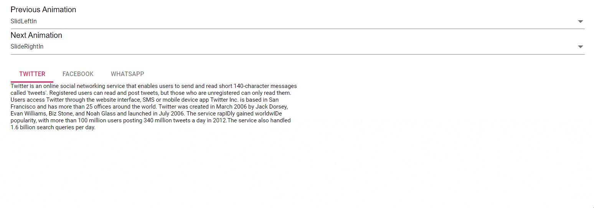

# Animations in Blazor Tabs Component

The [Blazor Tabs](https://www.syncfusion.com/blazor-components/blazor-tabs) component supports custom animations for both previous and next actions from the provided animation option of `Animation` library. The animation property also allows to set `Easing`, `Duration` and various other effects.

Default animation is given as `SlideLeftIn` for previous tab animation and `SlideRightIn` for next tab animation. Disable the animation by setting the animation `Effect` as `None`. Also, please use the following CSS to disable indicator animation for animation `Effect` as `None`.

```CSS

.e-tab .e-tab-header:not(.e-vertical) .e-indicator, .e-tab .e-tab-header.e-vertical .e-indicator {
    transition: none;
}

```

The sample demonstrates some types of animation that suits our Tabs. Check all the animation effects here.

```cshtml
@using Syncfusion.Blazor
@using Syncfusion.Blazor.Navigations
@using Syncfusion.Blazor.DropDowns

<div class="row">
    <div class="col-xs-6 col-sm-6 col-lg-6 col-md-6">
        <label> Previous Animation </label>
    </div>
    <div class="col-xs-6 col-sm-6 col-lg-6 col-md-6">
        <SfDropDownList TValue="AnimationEffect" DataSource="@AnimationData" TItem="Effect" @bind-Value="PreviousEffect">
            <DropDownListEvents ValueChange="PreviousChange" TValue="AnimationEffect" TItem="Effect"></DropDownListEvents>
            <DropDownListFieldSettings Value="ID" Text="Text"></DropDownListFieldSettings>
        </SfDropDownList>
    </div>
</div>
<div class="row">
    <div class="col-xs-6 col-sm-6 col-lg-6 col-md-6">
        <label> Next Animation </label>
    </div>
    <div class="col-xs-6 col-sm-6 col-lg-6 col-md-6">
        <SfDropDownList TValue="AnimationEffect" DataSource="@AnimationData" TItem="Effect" @bind-Value="NextEffect">
            <DropDownListEvents ValueChange="NextChange" TValue="AnimationEffect" TItem="Effect"></DropDownListEvents>
            <DropDownListFieldSettings Value="ID" Text="Text"></DropDownListFieldSettings>
        </SfDropDownList>
    </div>
</div>
<br />

<SfTab Width="600px">
    <TabAnimationSettings>
        <TabAnimationPrevious Effect="@PreviousEffect"></TabAnimationPrevious>
        <TabAnimationNext Effect="@NextEffect"></TabAnimationNext>
    </TabAnimationSettings>
    <TabItems>
        <TabItem Content="@Content1">
            <ChildContent>
                <TabHeader Text="Twitter"></TabHeader>
            </ChildContent>
        </TabItem>
        <TabItem Content="@Content2">
            <ChildContent>
                <TabHeader Text="Facebook"></TabHeader>
            </ChildContent>
        </TabItem>
        <TabItem Content="@Content3">
            <ChildContent>
                <TabHeader Text="WhatsApp"></TabHeader>
            </ChildContent>
        </TabItem>
    </TabItems>
</SfTab>

@code{
    public AnimationEffect PreviousEffect = AnimationEffect.SlideLeftIn;
    public AnimationEffect NextEffect = AnimationEffect.SlideRightIn;

    public string Content1 = "Twitter is an online social networking service that enables users to send and read short 140-character " +
            "messages called 'tweets'. Registered users can read and post tweets, but those who are unregistered can only read " +
            "them. Users access Twitter through the website interface, SMS or mobile device app Twitter Inc. is based in San " +
            "Francisco and has more than 25 offices around the world. Twitter was created in March 2006 by Jack Dorsey, " +
            "Evan Williams, Biz Stone, and Noah Glass and launched in July 2006. The service rapIDly gained worldwIDe popularity, " +
            "with more than 100 million users posting 340 million tweets a day in 2012.The service also handled 1.6 billion " +
            "search queries per day.";
    public string Content2 = "Facebook is an online social networking service headquartered in Menlo Park, California. Its website was " +
            "launched on February 4, 2004, by Mark Zuckerberg with his Harvard College roommates and fellow students Eduardo " +
            "Saverin, Andrew McCollum, Dustin Moskovitz and Chris Hughes.The founders had initially limited the website  " +
            "membership to Harvard students, but later expanded it to colleges in the Boston area, the Ivy League, and Stanford " +
            "University. It gradually added support for students at various other universities and later to high-school students.";
    public string Content3 = "WhatsApp Messenger is a proprietary cross-platform instant messaging client for smartphones that operates " +
            "under a subscription business model. It uses the Internet to send Text messages, images, vIDeo, user location and " +
            "audio media messages to other users using standard cellular mobile numbers. As of February 2016, WhatsApp had a user  " +
            "base of up to one billion,[10] making it the most globally popular messaging application. WhatsApp Inc., based in " +
            "Mountain View, California, was acquired by Facebook Inc. on February 19, 2014, for approximately US$19.3 billion.";

    List<Effect> AnimationData = new List<Effect> {
        new Effect() { ID= AnimationEffect.SlideLeftIn, Text= "SlidLeftIn" },
        new Effect() { ID= AnimationEffect.SlideRightIn, Text= "SlideRightIn" },
        new Effect() { ID= AnimationEffect.FadeIn, Text= "FadeIn" },
        new Effect() { ID= AnimationEffect.FadeOut, Text= "FadeOut" },
        new Effect() { ID= AnimationEffect.FadeZoomIn, Text= "FadeZoomIn" },
        new Effect() { ID= AnimationEffect.FadeZoomOut, Text= "FadeZoomOut" },
        new Effect() { ID= AnimationEffect.ZoomIn, Text= "ZoomIn" },
        new Effect() { ID= AnimationEffect.ZoomOut, Text= "ZoomOut" },
        new Effect() { ID= AnimationEffect.None, Text= "None" }
    };
    public void PreviousChange(Syncfusion.Blazor.DropDowns.ChangeEventArgs<AnimationEffect, Effect> args)
    {
        this.PreviousEffect = args.Value;
    }
    public void NextChange(Syncfusion.Blazor.DropDowns.ChangeEventArgs<AnimationEffect, Effect> args)
    {
        this.NextEffect = args.Value;
    }
    public class Effect
    {
        public AnimationEffect ID { get; set; }
        public string Text { get; set; }
    }
}
```

