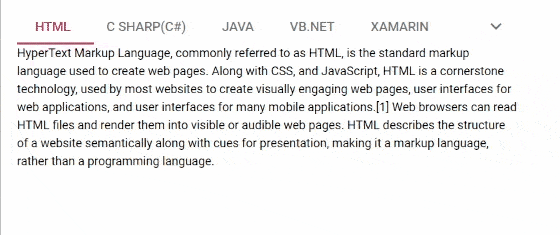

# Prevent reorder active tab in Blazor Tabs Component

We can able to prevent the changing of the active tab item on resizing the browser when overflow mode is popup by using the [ReorderActiveTab](https://help.syncfusion.com/cr/blazor/Syncfusion.Blazor.Navigations.SfTab.html#Syncfusion_Blazor_Navigations_SfTab_ReorderActiveTab) property. By default, the active Tab should be reordered when we click the tab items from the popup. If we set `false` to [ReorderActiveTab](https://help.syncfusion.com/cr/blazor/Syncfusion.Blazor.Navigations.SfTab.html#Syncfusion_Blazor_Navigations_SfTab_ReorderActiveTab) property the active tab item from the popup will not be reordered and an active item is highlighted inside the popup. The following code example depicts to prevent the reorder active tab item inside the popup.

```cshtml

@using Syncfusion.Blazor.Navigations

<SfTab OverflowMode="OverflowMode.Popup" Width="500px" ReorderActiveTab="false">
    <TabItems>
        <TabItem Content="HyperText Markup Language, commonly referred to as HTML, is the standard markup language used to create web pages. Along with CSS, and JavaScript, HTML is a cornerstone technology, used by most websites to create visually engaging web pages, user interfaces for web applications, and user interfaces for many mobile applications.[1] Web browsers can read HTML files and render them into visible or audible web pages. HTML describes the structure of a website semantically along with cues for presentation, making it a markup language, rather than a programming language.">
            <ChildContent>
                <TabHeader Text="HTML"></TabHeader>
            </ChildContent>
        </TabItem>
        <TabItem Content="C# is intended to be a simple, modern, general-purpose, object-oriented programming language. Its development team is led by Anders Hejlsberg. The most recent version is C# 5.0, which was released on August 15, 2012.">
            <ChildContent>
                <TabHeader Text="C Sharp(C#)"></TabHeader>
            </ChildContent>
        </TabItem>
        <TabItem Content="Java is a set of computer software and specifications developed by Sun Microsystems, later acquired by Oracle Corporation, that provides a system for developing application software and deploying it in a cross-platform computing environment. Java is used in a wide variety of computing platforms from embedded devices and mobile phones to enterprise servers and supercomputers. While less common, Java applets run in secure, sandboxed environments to provide many features of native applications and can be embedded in HTML pages.">
            <ChildContent>
                <TabHeader Text="Java"></TabHeader>
            </ChildContent>
        </TabItem>
        <TabItem Content="The command-line compiler, VBC.EXE, is installed as part of the freeware .NET Framework SDK. Mono also includes a command-line VB.NET compiler. The most recent version is VB 2012, which was released on August 15, 2012.">
            <ChildContent>
                <TabHeader Text="VB.Net"></TabHeader>
            </ChildContent>
        </TabItem>
        <TabItem Content="Xamarin is a San Francisco, California based software company created in May 2011[3] by the engineers that created Mono,[4] Mono for Android and MonoTouch that are cross-platform implementations of the Common Language Infrastructure (CLI) and Common Language Specifications (often called Microsoft .NET). With a C#-shared codebase, developers can use Xamarin tools to write native Android, iOS, and Windows apps with native user interfaces and share code across multiple platforms.[5] Xamarin has over 1 million developers in more than 120 countries around the World as of May 2015.">
            <ChildContent>
                <TabHeader Text="Xamarin"></TabHeader>
            </ChildContent>
        </TabItem>
        <TabItem Content="ASP.NET is an open-source server-side web application framework designed for web development to produce dynamic web pages. It was developed by Microsoft to allow programmers to build dynamic web sites, web applications and web services. It was first released in January 2002 with version 1.0 of the .NET Framework, and is the successor to Microsoft's Active Server Pages (ASP) technology. ASP.NET is built on the Common Language Runtime (CLR), allowing programmers to write ASP.NET code using any supported .NET language. The ASP.NET SOAP extension framework allows ASP.NET components to process SOAP messages.">
            <ChildContent>
                <TabHeader Text="ASP.NET"></TabHeader>
            </ChildContent>
        </TabItem>
        <TabItem Content="The ASP.NET MVC is a web application framework developed by Microsoft, which implements the model–view–controller (MVC) pattern. It is open-source software, apart from the ASP.NET Web Forms component which is proprietary. In the later versions of ASP.NET, ASP.NET MVC, ASP.NET Web API, and ASP.NET Web Pages (a platform using only Razor pages) will merge into a unified MVC 6.The project is called ASP.NET vNext.">
            <ChildContent>
                <TabHeader Text="ASP.NET MVC"></TabHeader>
            </ChildContent>
        </TabItem>
        <TabItem Content="JavaScript (JS) is an interpreted computer programming language. It was originally implemented as part of web browsers so that client-side scripts could interact with the user, control the browser, communicate asynchronously, and alter the document content that was displayed.[5] More recently, however, it has become common in both game development and the creation of desktop applications.">
            <ChildContent>
                <TabHeader Text="JavaScript"></TabHeader>
            </ChildContent>
        </TabItem>
    </TabItems>
</SfTab>

```

