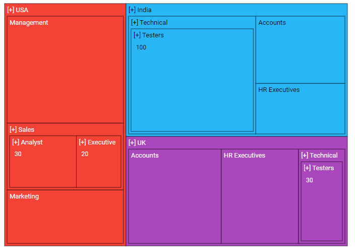
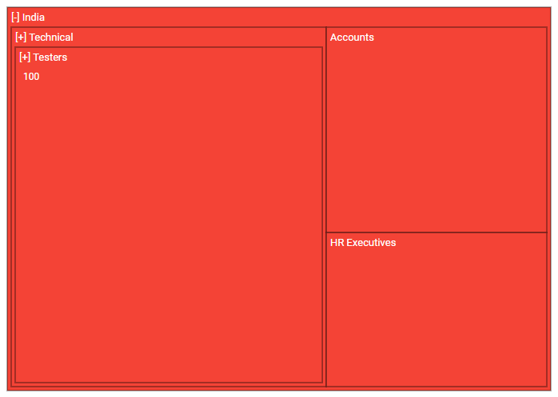

# Drill-down in Blazor TreeMap Component

The [Blazor TreeMap](https://www.syncfusion.com/blazor-components/blazor-treemap) component supports drill-down to expose the hierarchy, achieved by clicking a node. If an item is clicked in the TreeMap, it will be moved to the next level or sub level hierarchy and returned back to the previous level by clicking the node.

## Perform drill-down

The TreeMap items can be drilled by setting the [EnableDrillDown](https://help.syncfusion.com/cr/blazor/Syncfusion.Blazor.TreeMap.SfTreeMap-1.html#Syncfusion_Blazor_TreeMap_SfTreeMap_1_EnableDrillDown) property to **true**.

```cshtml
@using Syncfusion.Blazor.TreeMap

<SfTreeMap WeightValuePath="EmployeeCount" TValue="Employee" DataSource="Employees" EnableDrillDown=true Palette='new string[] {"#f44336", "#29b6f6", "#ab47bc", "#ffc107", "#5c6bc0", "#009688"}'>
    <TreeMapLevels>
        <TreeMapLevel GroupPath="Country">
            <TreeMapLevelBorder Color="black" Width="0.5">
            </TreeMapLevelBorder>
        </TreeMapLevel>
        <TreeMapLevel GroupPath="JobDescription">
            <TreeMapLevelBorder Color="black" Width="0.5">
            </TreeMapLevelBorder>
        </TreeMapLevel>
        <TreeMapLevel GroupPath="JobGroup">
            <TreeMapLevelBorder Color="black" Width="0.5">
            </TreeMapLevelBorder>
        </TreeMapLevel>
    </TreeMapLevels>
</SfTreeMap>

@code{
    public class Employee
    {
        public string Country { get; set; }
        public string JobDescription { get; set; }
        public string JobGroup { get; set; }
        public int EmployeeCount { get; set; }
    };
    public List<Employee> Employees = new List<Employee> {
        new Employee { Country= "USA", JobDescription= "Sales", JobGroup= "Executive", EmployeeCount= 20 },
        new Employee { Country= "USA", JobDescription= "Sales", JobGroup= "Analyst", EmployeeCount= 30 },
        new Employee { Country= "USA", JobDescription= "Marketing", EmployeeCount= 40 },
        new Employee { Country= "USA", JobDescription= "Management", EmployeeCount= 80 },
        new Employee { Country= "India", JobDescription= "Technical", JobGroup= "Testers", EmployeeCount= 100 },
        new Employee { Country= "India", JobDescription= "HR Executives", EmployeeCount= 30 },
        new Employee { Country= "India", JobDescription= "Accounts", EmployeeCount= 40 },
        new Employee { Country= "UK", JobDescription= "Technical", JobGroup= "Testers", EmployeeCount= 30 },
        new Employee { Country= "UK", JobDescription= "HR Executives", EmployeeCount= 50 },
        new Employee { Country= "UK", JobDescription= "Accounts", EmployeeCount= 60 }
    };
}
```



## On-demand data loading

All the child items are rendered during the normal drill-down process, and visible at the initial rendering of the TreeMap. But on-demand data loading, it will not render child items at initial rendering, and child nodes will be rendered during the drill-down process by setting the [DrillDownView](https://help.syncfusion.com/cr/blazor/Syncfusion.Blazor.TreeMap.SfTreeMap-1.html#Syncfusion_Blazor_TreeMap_SfTreeMap_1_DrillDownView) property to **true**.

```cshtml
@using Syncfusion.Blazor.TreeMap

<SfTreeMap WeightValuePath="EmployeeCount" TValue="Employee" DataSource="Employees" EnableDrillDown=true DrillDownView ="true" Palette='new string[] {"#f44336", "#29b6f6", "#ab47bc", "#ffc107", "#5c6bc0", "#009688"}'>
    <TreeMapLevels>
        <TreeMapLevel GroupPath="Country">
            <TreeMapLevelBorder Color="black" Width="0.5">
            </TreeMapLevelBorder>
        </TreeMapLevel>
        <TreeMapLevel GroupPath="JobDescription">
            <TreeMapLevelBorder Color="black" Width="0.5">
            </TreeMapLevelBorder>
        </TreeMapLevel>
        <TreeMapLevel GroupPath="JobGroup">
            <TreeMapLevelBorder Color="black" Width="0.5">
            </TreeMapLevelBorder>
        </TreeMapLevel>
    </TreeMapLevels>
</SfTreeMap>
```

> Refer to the [code block](#perform-drill-down) to know about the property value of **Employees**.


## Breadcrumb support

TreeMap items are drilled, up to any level of parent using breadcrumb navigation and the level from root parent to current level is displayed at the top of item layout. It can be enabled by using the [EnableBreadcrumb](https://help.syncfusion.com/cr/blazor/Syncfusion.Blazor.TreeMap.SfTreeMap-1.html#Syncfusion_Blazor_TreeMap_SfTreeMap_1_EnableBreadcrumb) property to **true** and customize the breadcrumb connector using the [BreadcrumbConnector](https://help.syncfusion.com/cr/blazor/Syncfusion.Blazor.TreeMap.SfTreeMap-1.html#Syncfusion_Blazor_TreeMap_SfTreeMap_1_BreadcrumbConnector) property. By default, **-**(hyphen) is the connector.

```cshtml
@using Syncfusion.Blazor.TreeMap

<SfTreeMap WeightValuePath="EmployeeCount" TValue="Employee" DataSource="Employees" EnableDrillDown=true EnableBreadcrumb="true" BreadcrumbConnector=" -> " Palette='new string[] {"#f44336", "#29b6f6", "#ab47bc", "#ffc107", "#5c6bc0", "#009688"}'>
    <TreeMapLevels>
        <TreeMapLevel GroupPath="Country">
            <TreeMapLevelBorder Color="black" Width="0.5">
            </TreeMapLevelBorder>
        </TreeMapLevel>
        <TreeMapLevel GroupPath="JobDescription">
            <TreeMapLevelBorder Color="black" Width="0.5">
            </TreeMapLevelBorder>
        </TreeMapLevel>
        <TreeMapLevel GroupPath="JobGroup">
            <TreeMapLevelBorder Color="black" Width="0.5">
            </TreeMapLevelBorder>
        </TreeMapLevel>
    </TreeMapLevels>
</SfTreeMap>
```

> Refer to the [code block](#perform-drill-down) to know about the property value of the **Employees**.


## Initial drill-down

TreeMap items can be drilled on initial rendering and it can be enabled by specifying the item index in the [GroupIndex](https://help.syncfusion.com/cr/blazor/Syncfusion.Blazor.TreeMap.TreeMapInitialDrillSettings.html#Syncfusion_Blazor_TreeMap_TreeMapInitialDrillSettings_GroupIndex) property and level order name in the [GroupName](https://help.syncfusion.com/cr/blazor/Syncfusion.Blazor.TreeMap.TreeMapInitialDrillSettings.html#Syncfusion_Blazor_TreeMap_TreeMapInitialDrillSettings_GroupName) property of the [TreeMapInitialDrillSettings](https://help.syncfusion.com/cr/blazor/Syncfusion.Blazor.TreeMap.TreeMapInitialDrillSettings.html).

```cshtml
@using Syncfusion.Blazor.TreeMap

<SfTreeMap WeightValuePath="EmployeeCount" TValue="Employee" DataSource="Employees" EnableDrillDown=true Palette='new string[] {"#f44336", "#29b6f6", "#ab47bc", "#ffc107", "#5c6bc0", "#009688"}'>
    <TreeMapInitialDrillSettings GroupIndex="0" GroupName="India"></TreeMapInitialDrillSettings>
    <TreeMapLevels>
        <TreeMapLevel GroupPath="Country">
            <TreeMapLevelBorder Color="black" Width="0.5">
            </TreeMapLevelBorder>
        </TreeMapLevel>
        <TreeMapLevel GroupPath="JobDescription">
            <TreeMapLevelBorder Color="black" Width="0.5">
            </TreeMapLevelBorder>
        </TreeMapLevel>
        <TreeMapLevel GroupPath="JobGroup">
            <TreeMapLevelBorder Color="black" Width="0.5">
            </TreeMapLevelBorder>
        </TreeMapLevel>
    </TreeMapLevels>
</SfTreeMap>
```

> Refer to the [code block](#perform-drill-down) to know about the property value of **Employees**.

